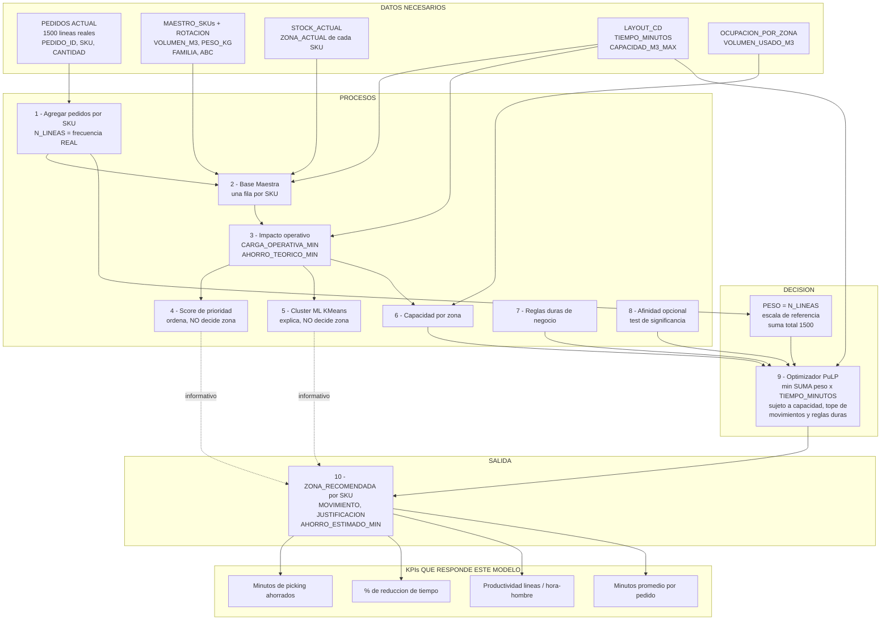

# Flujo de datos — Modelo 1 (Velocidad de picking)

Recorrido completo, paso a paso, de todo lo que el backend hace con los datos desde que se ingiere el Excel hasta que sale la recomendación final por SKU. Cubre exactamente el camino que sigue `POST /pipeline/ejecutar` para el modelo que ya está implementado y corriendo (Modelo 1 — minimizar tiempo de picking). Para cada paso: qué variables entran, qué información se usa, qué calcula, y qué resultado busca. Al final se aclara explícitamente cómo (y si) el score, el cluster ML y la afinidad influyen en la zona final — es la pregunta que más se presta a confusión.

---

## 0. Datos de entrada (crudos, ya validados por `/ingesta`)

Seis tablas persistidas en SQLite tras un `POST /ingesta` exitoso — se reemplazan por completo en cada carga, no son incrementales:

| Tabla | Fila = | Columnas clave |
|---|---|---|
| `sku_maestro` (hoja `MAESTRO_SKUs`) | Un SKU | `SKU, MARCA, FAMILIA, VOLUMEN_M3, PESO_KG` |
| `rotacion` (hoja `ROTACIÓN`) | Un SKU | `SKU, ROTACION_6M, ABC` |
| `stock_actual` (hoja `STOCK_ACTUAL`) | Una ubicación física | `SKU, ZONA_ACTUAL, VOLUMEN_M3, PESO_KG` |
| `layout_cd` (hoja `LAYOUT_CD`) | Una zona (9 en el dataset de práctica) | `ZONA, DISTANCIA_METROS, TIEMPO_MINUTOS, CAPACIDAD_M3_MAX` |
| `ocupacion_zona` (hoja `OCUPACION_POR_ZONA`) | Una zona | `ZONA, CAPACIDAD_MAX_M3, VOLUMEN_USADO_M3` |
| `pedidos` (hoja `PEDIDOS ACTUAL`) | Una línea de pedido | `PEDIDO_ID, LINEA, SKU, CANTIDAD, ZONA_ACTUAL, TIEMPO_HOY_MIN` |

Dataset de práctica: 100 SKU, 1500 líneas de pedido repartidas en 435 pedidos (~3.45 líneas/pedido).

---

## 1. Agregar pedidos a nivel SKU

**Función**: `app/dominio/indicadores.py::construir_pedidos_por_sku` (Fase 3 del notebook original).

- **Entra**: `pedidos` completo (nivel línea).
- **Agrupa por `SKU`** y calcula:
  - `N_LINEAS` = cantidad de líneas donde aparece ese SKU (`size` del grupo).
  - `N_PEDIDOS` = pedidos distintos donde aparece (`PEDIDO_ID.nunique()`).
  - `CANT_TOTAL` = suma de `CANTIDAD`.
  - `CANT_PROMEDIO` = promedio de `CANTIDAD`.
  - `TIEMPO_OBSERVADO_PROM`/`TIEMPO_OBSERVADO_TOTAL` = promedio/suma de `TIEMPO_HOY_MIN`.
  - `UNIDADES_POR_PEDIDO` = `CANT_TOTAL / N_PEDIDOS` (0 si `N_PEDIDOS = 0`).
- **Por qué `N_LINEAS` y no `ROTACION_6M`**: `N_LINEAS` es la frecuencia REAL de picking (cuántas veces de verdad se fue a buscar ese SKU). `ROTACION_6M` es un dato declarado del Excel que **no correlaciona con los hits reales** (Pearson 0.028, hallazgo ya validado sobre este dataset). Por eso todo el resto del pipeline usa `N_LINEAS` como criterio de velocidad, nunca `ROTACION_6M`.
- **Resultado que busca**: pasar de 1500 filas sueltas (una por línea de pedido) a 100 filas (una por SKU), con la frecuencia real ya agregada.

## 2. Integrar todo en la Base Maestra

**Función**: `app/dominio/impacto.py::construir_base_maestra` (Fases 4 del notebook).

- **Entra**: `sku_maestro` + `rotacion` + `stock_actual` + el agregado del paso 1 + `layout_cd`.
- **Cruces** (todos por `SKU`, salvo el último por `ZONA_ACTUAL`):
  1. `sku_maestro` ⟕ `rotacion` (agrega `ROTACION_6M`, `ABC`).
  2. ⟕ `stock_actual` (agrega `ZONA_ACTUAL`, ubicación física).
  3. ⟕ agregado de pedidos del paso 1 (agrega `N_LINEAS`, `N_PEDIDOS`, etc. — se rellenan con 0 los SKU sin ningún pedido).
  4. ⟕ `layout_cd` renombrado (`ZONA`→`ZONA_ACTUAL`, `TIEMPO_MINUTOS`→`TIEMPO_LAYOUT_ACTUAL`, `DISTANCIA_METROS`→`DISTANCIA_ACTUAL_M`, `CAPACIDAD_M3_MAX`→`CAPACIDAD_ZONA_ACTUAL`) — agrega cuánto tiempo/distancia le toma hoy a un picker llegar a la zona donde está ese SKU.
- **Validación inmediata** (aborta con error explícito, nunca sigue con datos huecos):
  - Ningún `SKU` duplicado tras los cruces.
  - Ningún SKU sin `ZONA_ACTUAL` (stock sin ubicación).
  - Ninguna `ZONA_ACTUAL` que no exista en `layout_cd` (zona sin tiempo declarado).
- **Resultado que busca**: una única tabla, una fila por SKU, con todo lo necesario para calcular impacto — la "Base Maestra" que alimenta el resto del pipeline.

## 3. Impacto operativo

**Función**: `app/dominio/impacto.py::calcular_impacto_operativo` (Fases 5 del notebook).

- **Entra**: `N_LINEAS`, `TIEMPO_LAYOUT_ACTUAL` de cada SKU, y `TIEMPO_MINUTOS.min()` de todo `layout_cd` (el tiempo de la zona más rápida del CD).
- **Calcula**:
  - `CARGA_OPERATIVA_MIN = N_LINEAS × TIEMPO_LAYOUT_ACTUAL` — cuántos minutos-hombre cuesta hoy ese SKU en total.
  - `AHORRO_TEORICO_MIN = N_LINEAS × (TIEMPO_LAYOUT_ACTUAL − tiempo_mínimo_CD)`, nunca negativo (`clip(lower=0)`) — el TECHO de ahorro si ese SKU terminara en la zona más rápida posible. **No es una promesa de que terminará ahí** — es solo una referencia para medir potencial, el notebook original ya lo aclaraba así.
- **Resultado que busca**: cuantificar, por SKU, "cuánto duele hoy" (`CARGA_OPERATIVA_MIN`) y "cuánto se podría ganar en el mejor caso" (`AHORRO_TEORICO_MIN`). Estas dos columnas alimentan directamente el score (paso 4) y el cluster ML (paso 5).

(El notebook original también calcula acá un `ranking_preliminar` por `AHORRO_TEORICO_MIN` y un análisis ABC vs. impacto — confirma que la clase ABC declarada NO explica por sí sola la carga/el ahorro, χ² ABC vs. ZONA_ACTUAL con p=0.646 sobre este dataset. Es diagnóstico exploratorio, no alimenta el optimizador.)

## 4. Score de prioridad — `SCORE_PRIORIDAD`

**Función**: `app/dominio/scoring.py::calcular_score_prioridad` (Fase 7 del notebook).

- **Entra**: `AHORRO_TEORICO_MIN`, `ROTACION_6M`, `ABC`, `VOLUMEN_M3` de cada SKU, más un diccionario de `pesos` (debe sumar 1.0, se valida explícitamente).
- **Normaliza** cada variable a [0,1] con min-max sobre todo el catálogo (`normalizar_01` — si la serie es constante, devuelve todo ceros en vez de dividir por cero):
  - `AHORRO_NORM` = `AHORRO_TEORICO_MIN` normalizado.
  - `ROTACION_NORM` = `ROTACION_6M` normalizado.
  - `ABC_SCORE` = mapeo fijo `{A: 1.00, B: 0.60, C: 0.30}`.
  - `FACILIDAD_MOVIMIENTO = 1 − VOLUMEN_NORM` (SKU chico/liviano = más fácil de mover = más cerca de 1).
- **Calcula**:
  ```
  SCORE_PRIORIDAD = 100 × (0.55·AHORRO_NORM + 0.20·ROTACION_NORM + 0.10·ABC_SCORE + 0.15·FACILIDAD_MOVIMIENTO)
  RANKING_SCORE   = posición de ese SKU ordenando por SCORE_PRIORIDAD descendente
  ```
  Los 4 pesos (0.55/0.20/0.10/0.15) son ajustables en vivo desde la vista "SKU · Slotting" (sliders).
- **Resultado que busca**: un número 0-100 y un ranking para que un humano sepa "por dónde conviene mirar primero" — un SKU con mucho ahorro potencial, buena clase ABC, alta rotación y fácil de mover puntúa alto.
- **⚠️ Cómo influye REALMENTE en la zona final: NO INFLUYE.** El optimizador (paso 8) nunca lee `SCORE_PRIORIDAD`. Es puramente informativo/de priorización para la persona que revisa la propuesta — la zona la decide una cuenta completamente distinta (`N_LINEAS × TIEMPO_MINUTOS`, ver paso 8).

## 5. Perfil por Machine Learning — `CLUSTER_ML` / `PERFIL_ML`

**Función**: `app/dominio/ml_perfil.py::calcular_ml_perfil` (Fases 18-23 del notebook).

- **Entra**: 9 variables por SKU, estandarizadas (`StandardScaler`, media 0 / desvío 1) — se descartan automáticamente las que no tengan variación en el lote:
  `ROTACION_6M, N_LINEAS, N_PEDIDOS, CANT_TOTAL, VOLUMEN_M3, PESO_KG, TIEMPO_LAYOUT_ACTUAL, CARGA_OPERATIVA_MIN, AHORRO_TEORICO_MIN`.
- **K-Means, K automático**: prueba K=2 a K=8, corre `KMeans(n_init=20)` para cada uno, se queda con el K que da mejor `silhouette_score` — nadie fija K a mano. **Se reentrena en cada ejecución del pipeline** (no carga un modelo `.joblib` fijo), para que el mismo código escale de 100 a miles de SKU sin recalibrar nada manualmente.
- **Calcula por SKU**:
  - `CLUSTER_ML` — a qué grupo pertenece.
  - `DISTANCIA_CENTROIDE` — qué tan lejos está del centro de su propio cluster.
  - `PERFIL_ML` — "Impacto alto/medio/bajo", según el ranking de `INDICE_IMPACTO_CLUSTER` de su cluster (promedio normalizado de `CARGA_OPERATIVA_MIN, AHORRO_TEORICO_MIN, N_LINEAS, ROTACION_6M` del cluster) dividido en tercios.
  - `PRIORIDAD_CLUSTER_RANK` — ranking de clusters por ese índice de impacto.
- **Explicabilidad sin caja negra** (`explicar_sku`, usado por `GET /recomendaciones/{sku}`): para un SKU puntual, descompone (1) perfil del centroide en unidades reales, (2) contribución al cuadrado de cada variable a la distancia, (3) distancia al cluster propio vs. al segundo más cercano (¿asignación ambigua?), (4) silhouette individual de ese SKU.
- **Resultado que busca**: agrupar SKU parecidos entre sí (no por una sola variable, por similitud multivariable) y dar una segunda mirada de prioridad, independiente del score ponderado — sirve para detectar, por ejemplo, un SKU con `SCORE_PRIORIDAD` bajo pero que cae en un cluster de "Impacto alto" (señal de que vale la pena revisarlo aparte, aunque el score no lo haya destacado).
- **⚠️ Cómo influye REALMENTE en la zona final: TAMPOCO INFLUYE.** Es explicación/segmentación en paralelo, nunca se cruza con el optimizador. `CLUSTER_ML`/`PERFIL_ML` se muestran junto al score para comparar, pero ninguno de los dos decide `ZONA_RECOMENDADA`.

## 6. Capacidad por zona

**Función**: `app/dominio/capacidad.py::calcular_capacidad` (Fase 9 del notebook).

- **Entra**: `ocupacion_zona` (`VOLUMEN_USADO_M3`, `CAPACIDAD_MAX_M3`) + el volumen ya sumado por zona de los SKU de la Base Maestra.
- **Calcula**:
  - `VOLUMEN_BASE_NO_MODELADO = VOLUMEN_USADO_M3 − VOLUMEN_MUESTRA_ACTUAL` (nunca negativo) — lo que ya ocupa stock fuera de la muestra de 100 SKU, para no contarlo dos veces cuando el optimizador sume el volumen de su propia asignación.
  - `USO_MODELO_ACTUAL_%` = uso reportado / capacidad máxima.
- **Resultado que busca**: el techo real de cada zona que el optimizador no puede pasar (restricción dura del paso 8). Dato curioso ya validado sobre el dataset de práctica: la restricción es casi vacua (0.98% de uso real vs. capacidad máxima) — el propio sistema lo declara así, no lo oculta.

## 7. Reglas de negocio (restricciones duras)

**Función**: `app/dominio/reglas/evaluador.py::aplicar_reglas_atributo` / `pares_familias_incompatibles`.

- **Entra**: las reglas activas que el usuario creó vía `POST/PUT/DELETE /reglas` (tipo `atributo` o `incompatibilidad`), evaluadas contra los campos del SKU (`FAMILIA`, etc.) con un evaluador propio de operadores seguros (`==, !=, >, >=, <, <=`, nunca `eval()`).
- **Calcula**:
  - `zona_unica_por_sku` — SKU que DEBEN terminar en una zona específica.
  - `zonas_excluidas_por_sku` — SKU que NO PUEDEN terminar en ciertas zonas.
  - Pares de familias que no pueden compartir zona.
  - `camino_decision_reglas` — registro de qué regla afectó a qué SKU y por qué, para la respuesta HTTP.
- **Resultado que busca**: restricciones que el optimizador debe cumplir sí o sí — nunca negociables por un buen score, se implementan como variables fijadas a 0/1, no como término del objetivo.

## 8. Afinidad de pedidos (opcional — solo si se pide o se fuerza)

**Función**: `app/dominio/afinidad.py`.

- **Entra**: `pedidos` completo (para ver qué SKU aparecen juntos en el mismo `PEDIDO_ID`).
- **Calcula**:
  1. `construir_pares_coocurrencia` — Lift/Jaccard/`N_COOCURRENCIA` por par de SKU.
  2. Grafo ponderado SKU-SKU → partición de Louvain → `comunidad_por_sku` (grupos de SKU que suelen pedirse juntos).
  3. **Test de significancia por remuestreo**: se permuta la columna `SKU` de los pedidos 200 veces (conserva tamaño de pedido y popularidad de cada SKU) y se recalcula la modularidad en cada réplica. Solo se activa si `modularidad_observada > percentil_95(modularidades_al_azar)`.
- **En el dataset de práctica, sin forzar: el test NO confirma señal** (0.132 observado vs. 0.147 del percentil 95 nulo) → `usar_afinidad = False`, efecto real = 0.
- **`forzar_afinidad=True`** (botón "Forzar afinidad (demo)" en Mapas): salta el test y aplica `comunidad_por_sku` igual, con un peso propio (`PESO_AFINIDAD_FORZADO = 60.0`, distinto del `PESO_AFINIDAD = 0.0` real) — `afinidad_motivo` en la respuesta siempre deja explícito que fue forzado, nunca se presenta como hallazgo confirmado. Verificado: mueve 14 de 100 SKU y reduce las zonas por comunidad (ej. una comunidad pasó de 4 a 2 zonas).
- **Resultado que busca**: si hay señal real (o se fuerza), `comunidad_por_sku` entra al optimizador como una variable `p[comunidad][zona]` que premia que TODOS los SKU de una comunidad terminen concentrados en pocas zonas.
- **⚠️ Cómo influye REALMENTE en la zona final: es la ÚNICA de las tres piezas de este documento (score, cluster ML, afinidad) que SÍ puede cambiar `ZONA_RECOMENDADA`** — y solo si se pide explícitamente (`usar_afinidad=True` con test confirmado, o `forzar_afinidad=True`). Nunca se activa por opinión ni por defecto.

## 9. El optimizador decide la zona (el único paso que asigna zona)

**Función**: `app/dominio/optimizador.py::ejecutar_optimizador` (Fases 10-11 del notebook). PuLP, solver CBC — programación lineal entera, matemática de optimización clásica, **no es Machine Learning**.

- **Variable de decisión**: `x[SKU][zona]` binaria = 1 si ese SKU se asigna a esa zona.
- **Entra**: `N_LINEAS` y `VOLUMEN_M3` por SKU, `TIEMPO_MINUTOS`/`CAPACIDAD_M3_MAX` por zona, las restricciones del paso 7, y (opcional) `comunidad_por_sku` del paso 8.
- **Minimiza**:
  ```
  costo_picking     = Σ N_LINEAS(SKU) × TIEMPO_MINUTOS(zona) × x[SKU][zona]
  costo_movimientos = Σ PENALIZACION_MOVIMIENTO × x[SKU][zona]   (para zona ≠ zona actual del SKU)
  costo_afinidad    = peso_afinidad × Σ p[comunidad][zona]        (solo si aplica, paso 8)

  minimizar: costo_picking + costo_movimientos + costo_afinidad
  ```
- **Sujeto a**:
  1. Una zona por SKU (`Σ_zona x[SKU][zona] = 1`).
  2. Capacidad por zona (`volumen_base_no_modelado + Σ volumen_sku × x ≤ capacidad_max`, del paso 6).
  3. Tope de movimientos: `Σ x[SKU][zona≠actual] ≤ max(1, round(N_SKU × porcentaje_max_movimiento))` — 20% por defecto.
  4. Zonas bloqueadas como destino nuevo (`ZONAS_NO_DESTINO`).
  5. Reglas de atributo fijadas (paso 7): `x[SKU][zona_forzada] = 1`, `x[SKU][zona_prohibida] = 0`.
  6. Incompatibilidad de familias (paso 7): dos familias en conflicto no pueden compartir zona.
- **Salida**: `zona_asignada: {SKU: ZONA}` — la ÚNICA decisión real de zona de todo el pipeline. Si el solver no encuentra estado "Optimal", aborta con `OptimizadorInfactibleError` (nunca entrega un resultado dudoso).

## 10. Ensamblar la recomendación final

**Función**: `app/dominio/recomendaciones.py::construir_recomendaciones` (Fases 12 y 14 del notebook).

- **Entra**: `zona_asignada` del paso 9 + la Base Maestra con score/ML/afinidad ya calculados (pasos 4-8).
- **Calcula, por SKU**:
  - `TIEMPO_NUEVO_MIN` = tiempo de la zona recomendada.
  - `COSTO_ACTUAL_MIN = N_LINEAS × TIEMPO_LAYOUT_ACTUAL`, `COSTO_NUEVO_MIN = N_LINEAS × TIEMPO_NUEVO_MIN`.
  - `AHORRO_ESTIMADO_MIN = COSTO_ACTUAL_MIN − COSTO_NUEVO_MIN`, `AHORRO_%`.
  - `MOVIMIENTO` = `"MOVER"` si `ZONA_ACTUAL ≠ ZONA_RECOMENDADA`, si no `"MANTENER"`.
  - `JUSTIFICACION` — texto armado según `MOVIMIENTO` (de dónde a dónde, cuántas visitas, cuánto cambia el tiempo, ahorro estimado — o "el optimizador no seleccionó un cambio").
- **Validación final** (`validar_factibilidad`, cinturón y tirantes): repite sobre el resultado ya extraído las mismas 3 comprobaciones duras del optimizador (capacidad no excedida, tope de movimientos no superado, ninguna zona nula) — si algo no cuadra, es un bug en el optimizador, nunca un caso de negocio válido.
- **Resultado que busca**: la tabla final que ve el usuario — una fila por SKU, con "hoy" y "propuesta" juntos, ordenada por `AHORRO_ESTIMADO_MIN` descendente.

## 11. KPIs globales

**Función**: `app/dominio/kpis.py::calcular_kpis` (Fase 13 del notebook).

- **Entra**: la tabla completa del paso 10 + `n_pedidos` (pedidos distintos del lote).
- **Calcula**: tiempo total actual vs. optimizado (`Σ COSTO_ACTUAL_MIN` vs. `Σ COSTO_NUEVO_MIN`), `reduccion_porcentaje`, `% SKU movidos`, productividad (`N_LINEAS totales / horas-hombre`), tiempo promedio por pedido (`Σtiempo / n_pedidos`, nunca `/ n_líneas` — es el error de método más frecuente).
- **Resultado que busca**: el resumen ejecutivo de una sola pantalla (el número "12.64 → 9.48 min/pedido" de la vista Resumen).

---

## 12. La escala de referencia — por qué Modelo 1 no necesita normalizarse

Este modelo usa `N_LINEAS` crudo como peso en la función objetivo, **sin ninguna normalización**. No es un descuido: es la escala contra la que están calibradas todas las demás constantes del optimizador, y por eso Modelo 2 y Modelo 3 se reescalan *hacia acá* (ver `2.md` §4.3 y `3.md` §4.2).

Medido sobre el lote de práctica:

| Magnitud | Valor |
|---|---|
| `N_LINEAS` por SKU | 6 a 27 |
| **`Σ N_LINEAS` (masa total del peso)** | **1 500** |
| `TIEMPO_MINUTOS` por zona | 1.60 a 8.04 |
| Costo de picking total del objetivo | ≈ 6 000 |

Los otros dos términos de la misma función objetivo son **constantes fijas** que se suman a ese total:

- `PENALIZACION_MOVIMIENTO` — minutos extra por mover un SKU.
- `PESO_AFINIDAD_FORZADO = 60.0` — minutos equivalentes por cada zona extra en que queda repartida una comunidad.

Ambas solo tienen sentido *relativo* a esa masa de ~6 000. Con la escala de Modelo 1, el término de afinidad aporta entre ~360 y ~3 200 → un empujón real pero que no manda, que es exactamente lo medido: forzar afinidad mueve 14 de 100 SKU.

**La regla de diseño que sale de acá, y que aplica a los tres modelos:**

```
peso_final(SKU) = peso_crudo(SKU) × ( Σ N_LINEAS / Σ peso_crudo )
```

Para Modelo 1 el factor es exactamente 1 (el peso crudo ya es `N_LINEAS`), así que la fórmula se cumple sin hacer nada. Para los otros dos, medido con la fórmula exacta de cada peso (ver `2.md` §4.2 y `3.md` §4.1):

| Modelo | Σ peso crudo | Factor de reescalado |
|---|---|---|
| 2 (valor) | 37.22 | **×40.30** |
| 3 (servicio) | 59.68 | **×25.14** |

Los dos se quedan **cortos frente a 1 500, en la misma dirección** — no es un desvío simétrico en direcciones opuestas. La corrección importa por una razón concreta: `VALOR_INVENTARIO_M2` normalizado a [0,1] antes de combinarse (§4.2 de `2.md`) ya no tiene nada que ver con su magnitud cruda en soles (que sí es ~1 544× la de `N_LINEAS` — esa es la razón de la variable sin normalizar, no la del peso que efectivamente entra al optimizador). Sin este reescalado, `PENALIZACION_MOVIMIENTO` y `PESO_AFINIDAD_FORZADO = 60.0` quedarían invisibles frente al costo de picking en los dos modelos nuevos, no solo en uno.

Multiplicar todo el vector de pesos por una constante **no altera el orden de prioridad entre SKU**: solo pone los tres modelos en la misma escala para que las constantes de negocio se calibren una sola vez y el valor objetivo del solver sea comparable entre modelos.

---

## 13. Flujo completo, de un vistazo



**Qué pregunta responde este modelo**: *¿cuánto tiempo de picking se ahorra el CD si los SKU que más se piden quedan en las zonas más cercanas?*

---

## La idea que conviene remarcar en una presentación

De las tres piezas que más se prestan a sonar como si "decidieran" la zona — **Score de prioridad, Cluster ML y Afinidad** — solo la última realmente puede hacerlo, y solo si se pide explícitamente:

| Pieza | ¿Es ML/estadística real? | ¿Decide `ZONA_RECOMENDADA`? |
|---|---|---|
| Score de prioridad (`SCORE_PRIORIDAD`) | No (fórmula ponderada fija) | **No** — solo ordena/prioriza |
| Cluster ML (`CLUSTER_ML`/`PERFIL_ML`) | Sí (KMeans) | **No** — solo explica/segmenta, corre en paralelo |
| Afinidad (Louvain + test de significancia) | Sí | **Sí, pero solo si se pide** (`usar_afinidad` + test confirmado, o `forzar_afinidad`) |
| Optimizador (PuLP) | No (optimización matemática) | **Sí — es el único que decide siempre** |

Score y Cluster ML son para que una persona entienda y priorice la propuesta ya calculada — nunca se cruzan con la cuenta que hace el optimizador (`N_LINEAS × TIEMPO_MINUTOS` + restricciones duras). La única forma de que algo además del optimizador puro influya en qué zona termina un SKU es la afinidad, y el sistema mismo se niega a activarla sin evidencia salvo que el usuario la fuerce explícitamente para una demostración.
