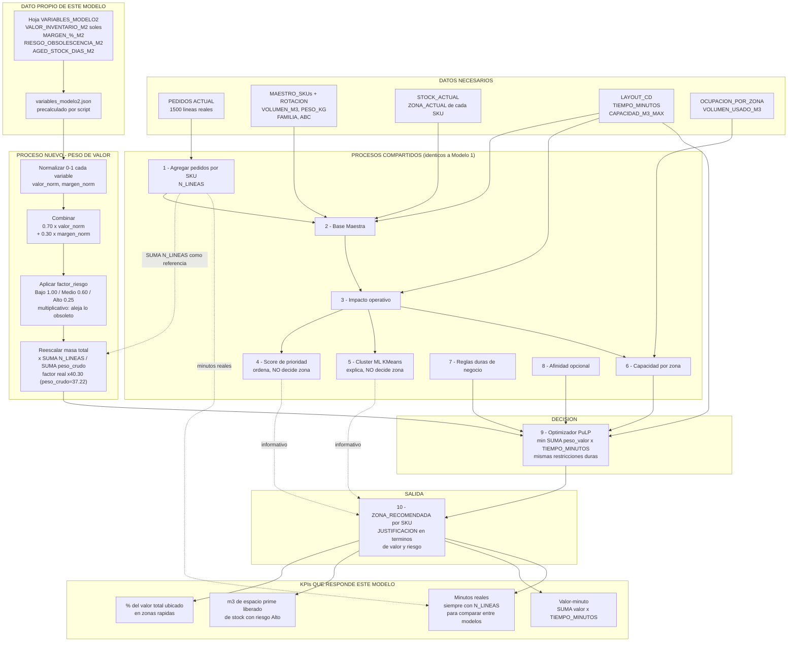

# Flujo de datos — Modelo 2 (Valor / rentabilidad del espacio)

Diseño del flujo de datos para el segundo modelo de slotting, análogo a `1.md` (Modelo 1 — velocidad de picking). **Documento de diseño: todavía no está implementado.** Se apoya en la hoja `VARIABLES_MODELO2` del Excel `IMPULSA_CD_Práctico Estudiantes variables m2 -m3.xlsx`.

> **Regla que no cambia:** igual que Modelo 1 y Modelo 3, este modelo usa siempre `TIEMPO_MINUTOS` tal como lo declara `LAYOUT_CD` en el Excel (`modo_distancia = "layout_cd"`). El modo SVG queda fuera de alcance por decisión del equipo.

---

## 1. La pregunta que responde este modelo

Modelo 1 pregunta *"¿qué SKU se pide más?"* y le da las zonas cercanas. Modelo 2 pregunta **"¿qué SKU vale más la pena tener en el espacio caro?"** — el espacio cercano a despacho es el recurso más caro del CD, así que se asigna por valor económico, no por frecuencia. Y en el otro extremo: el stock envejecido, con riesgo de no venderse nunca, no debería estar ocupando ese espacio.

---

## 2. Datos de entrada — qué agrega este modelo

Las 6 tablas del lote (`sku_maestro`, `rotacion`, `stock_actual`, `layout_cd`, `ocupacion_zona`, `pedidos`) **se usan exactamente igual que en Modelo 1**. Este modelo suma una fuente nueva: la hoja `VARIABLES_MODELO2`, 100 filas (una por SKU).

| Columna | Qué es | Cómo está construida |
|---|---|---|
| `COSTO_UNITARIO_M2` | Costo unitario en soles | `COSTO_BASE` por familia ± ajuste por tamaño/peso ± 10% de ruido |
| `MARGEN_%_M2` | Margen porcentual | `MARGEN_BASE` por familia ± 10% de ruido |
| `AGED_STOCK_DIAS_M2` | Días de antigüedad del stock | Simulado contra `AGED_MAX_DIAS` de la familia |
| `RIESGO_OBSOLESCENCIA_M2` | `Bajo` / `Medio` / `Alto` | Derivado de `AGED_STOCK_DIAS_M2` vs. el máximo de su familia |
| `VALOR_INVENTARIO_M2` | Valor económico en soles | **Verificado: `= COSTO_UNITARIO_M2 × ROTACION_6M`** (exacto en las 100 filas) |

Tabla de parámetros de negocio de la propia hoja (editable — son supuestos, no datos de Inchcape):

| Familia | `COSTO_BASE_S/` | `MARGEN_BASE_%` | `AGED_MAX_DIAS` |
|---|---|---|---|
| Filtros | 45 | 0.28 | 180 |
| Lubricantes | 60 | 0.18 | 150 |
| Pastillas | 80 | 0.32 | 200 |
| Correas | 55 | 0.35 | 220 |
| Soportes | 70 | 0.30 | 240 |

### 2.1 Lo que revisar los datos dejó en claro (y no está escrito en la hoja)

Tres hallazgos, todos verificados sobre las 100 filas reales, que condicionan el diseño:

1. **`VALOR_INVENTARIO_M2` NO es valor de inventario en stock — es valor movido en 6 meses.** La fórmula es `COSTO_UNITARIO_M2 × ROTACION_6M`, así que ya lleva rotación adentro. Consecuencia importante: es la **rotación declarada** del Excel, la misma que este proyecto ya determinó que no correlaciona con los hits reales (Pearson 0.028 contra `N_LINEAS`). Usarla como peso significa optimizar en parte contra una variable que ya sabemos poco confiable. Ver §4.1 para la alternativa.
2. **`RIESGO_OBSOLESCENCIA_M2` es casi redundante con `VALOR_INVENTARIO_M2`** — Spearman **−0.745** entre ambos (y −0.800 contra `AGED_STOCK_DIAS_M2`). Es decir: en este dataset, lo caro ya es en general lo poco envejecido. Sumar riesgo como un segundo criterio fuerte agregaría poco y haría creer que hay dos señales donde hay casi una.
3. **`MARGEN_%_M2` sí es una señal independiente** — Spearman −0.166 contra `VALOR_INVENTARIO_M2`. Es la única variable de la hoja que aporta información que el valor no tiene ya.

También: los umbrales de `RIESGO_OBSOLESCENCIA_M2` **no son reproducibles solo con el ratio antigüedad/máximo** (los rangos se solapan: `Bajo` llega a 0.587, `Medio` arranca en 0.427 y llega a 0.793, `Alto` arranca en 0.627). Hay otra variable participando que la hoja no documenta — se consume la etiqueta tal cual viene, no se intenta recalcular.

---

## 3. Los pasos que NO cambian respecto a Modelo 1

Estos se ejecutan idénticos — mismo código, mismo resultado. Ver `1.md` para el detalle de cada uno:

| Paso | Función | Por qué no cambia |
|---|---|---|
| 1. Agregar pedidos a nivel SKU | `indicadores.py::construir_pedidos_por_sku` | `N_LINEAS` se sigue necesitando para los KPIs en minutos reales (§7) |
| 2. Base Maestra | `impacto.py::construir_base_maestra` | La integración de fuentes es la misma |
| 3. Impacto operativo | `impacto.py::calcular_impacto_operativo` | `CARGA_OPERATIVA_MIN`/`AHORRO_TEORICO_MIN` alimentan score y ML |
| 4. Score de prioridad | `scoring.py` | Sigue siendo informativo, no decide zona |
| 5. Cluster ML | `ml_perfil.py` | Sigue siendo explicativo, no decide zona |
| 6. Capacidad por zona | `capacidad.py` | Misma restricción física |
| 7. Reglas de negocio | `reglas/evaluador.py` | Las reglas duras aplican igual en los 3 modelos |
| 8. Afinidad | `afinidad.py` | Opcional igual, con el mismo test de significancia |
| 10. Recomendación final | `recomendaciones.py` | Mismas columnas de salida |

**Lo único que cambia es el peso por SKU dentro de la función objetivo del optimizador (paso 9)** y el KPI de cabecera (paso 11).

---

## 4. El paso nuevo — construir el peso de valor

**Función nueva propuesta**: `app/dominio/objetivo_valor.py::peso_valor`.

### 4.1 Decisión de diseño: qué variable usar como base

Hay dos opciones y conviene elegirla conscientemente:

| Opción | Fórmula | A favor | En contra |
|---|---|---|---|
| **A — la de la hoja** | `VALOR_INVENTARIO_M2` (= costo × `ROTACION_6M`) | Es la variable que el Excel entrega; el relato "usamos las variables del modelo 2" es directo | Arrastra `ROTACION_6M`, que este proyecto ya documentó como no correlacionada con los hits reales |
| **B — valor realmente movido** | `COSTO_UNITARIO_M2 × N_LINEAS` | Usa la frecuencia REAL de picking, coherente con la decisión que ya se tomó en Modelo 1 | Se aparta de la columna literal de la hoja; hay que explicarlo |

**Recomendación: opción A para la entrega académica** (mantiene la trazabilidad con la hoja entregada, que es lo que se está presentando), **documentando la limitación**. Si en algún momento esto se lleva a datos reales, la opción B es la correcta y el cambio es una línea.

### 4.2 Fórmula del peso

```
valor_norm(SKU)   = normalizar_01(VALOR_INVENTARIO_M2)          # 0 a 1, min-max sobre el catálogo
margen_norm(SKU)  = normalizar_01(MARGEN_%_M2)                  # única señal independiente (§2.1)
factor_riesgo(SKU)= {Bajo: 1.00, Medio: 0.60, Alto: 0.25}       # multiplicativo

peso_valor_crudo(SKU) = (0.70 · valor_norm + 0.30 · margen_norm) × factor_riesgo
```

- Los pesos 0.70/0.30 son configurables (mismo patrón que `PESOS_SCORE` en `config.py`, validados a que sumen 1.0).
- **El `factor_riesgo` es multiplicativo, no un término aparte**: un SKU caro pero envejecido ve su prioridad recortada a un cuarto, así que pierde la competencia por las zonas cercanas y termina desplazado a las lejanas. **No hace falta un término de repulsión**: en la función objetivo `Σ peso × tiempo × x`, un peso bajo significa "me da igual dónde caiga", y como los pesos altos se llevan las zonas cercanas, lo que sobra son las lejanas. El efecto "relegar stock envejecido a mezzanine/rack alto" sale solo, con la estructura del optimizador que ya existe.
- Se usa `factor_riesgo` con valores suaves (no 0) a propósito: llevarlo a 0 haría que el optimizador ignore por completo dónde cae ese SKU, y podría dejarlo en una zona cercana solo porque le sobró capacidad ahí.

### 4.3 Normalización de escala — obligatoria, no opcional

Este es el punto que más fácil se pasa por alto, y donde hay que distinguir dos escalas distintas para no confundirlas:

| Magnitud | Qué es | Suma total |
|---|---|---|
| `N_LINEAS` (Modelo 1) | el peso que usa el optimizador hoy | **1 500** |
| `VALOR_INVENTARIO_M2` **crudo**, en soles (la columna de la hoja, sin normalizar) | *no* es lo que entra al optimizador | **2 315 588** (1 544× la de Modelo 1) |
| `peso_valor_crudo(SKU)` de §4.2, ya normalizado y combinado con margen y riesgo | lo que efectivamente competiría por entrar al optimizador, antes del paso final de esta sección | **37.22** |

El 1 544× es la razón de la columna en soles, **no** la del peso que la fórmula de §4.2 realmente construye — `normalizar_01` ya aplasta `VALOR_INVENTARIO_M2` a [0,1] antes de combinarlo con `margen_norm` y el `factor_riesgo`, así que la magnitud en soles nunca llega a competir con `TIEMPO_MINUTOS` en el objetivo. El problema real de escala es el otro, y va en la dirección contraria: `peso_valor_crudo` (suma 37.22) se queda **corto** frente a la masa de referencia de Modelo 1 (1 500), no largo.

Si no se reescalara:

- `PENALIZACION_MOVIMIENTO` (minutos extra por mover un SKU) **dominaría** el objetivo en vez de ser un matiz — lo contrario del riesgo que se suele imaginar.
- `PESO_AFINIDAD_FORZADO = 60.0` sería casi el doble de todo el costo de picking (60 contra ~37) — el botón "Forzar afinidad" pasaría de ser una preferencia suave a mandar sobre el criterio de valor.
- El valor objetivo del solver no sería comparable contra el de Modelo 1.

**Solución**: reescalar para que la masa total sea la misma que la de Modelo 1 — **factor real ×40.30**, verificado sobre el lote:

```
peso_valor(SKU) = peso_valor_crudo(SKU) × ( Σ N_LINEAS / Σ peso_valor_crudo )
                = peso_valor_crudo(SKU) × ( 1500 / 37.22 )
                = peso_valor_crudo(SKU) × 40.30
```

Multiplicar todo el vector por una constante no cambia el orden de prioridad entre SKU (verificado: `argsort` idéntico antes y después). Así los tres modelos entregan al optimizador un vector de pesos con la misma suma total, y todas las constantes de negocio (`PENALIZACION_MOVIMIENTO`, `PESO_AFINIDAD`, `PESO_AFINIDAD_FORZADO`) conservan su significado sin recalibrarse por modelo. Ver `1.md` §12 para el mismo argumento aplicado a los dos modelos nuevos juntos, y §4.2 de este documento para un guard adicional: `normalizar_01` puede dar 0 exacto en el mínimo del catálogo, y un peso 0 haría al optimizador indiferente a dónde cae ese SKU — se aplica un piso mínimo antes de reescalar.

### 4.4 De dónde salen estos datos en runtime

No hace falta tocar `/ingesta` ni crear tablas SQL nuevas. Mismo patrón ya usado para la distancia SVG:

```
scripts/extraer_variables_modelo.py   (se corre una vez, o cuando cambie el Excel)
        │  lee la hoja VARIABLES_MODELO2 con header=12
        ▼
backend/data/variables_modelo2.json   {"SKU00001": {"VALOR_INVENTARIO_M2": 17635.38, ...}, ...}
        │  lo carga app/dominio/objetivo_valor.py
        ▼
peso_valor(SKU) listo para el optimizador
```

Si un SKU del lote no aparece en el JSON, **no se le inventa un valor**: el pipeline debe abortar con un error explícito (mismo criterio que `DistanciaSvgNoDisponibleError`), porque un peso 0 silencioso lo mandaría a la peor zona sin que nadie se entere.

---

## 5. El optimizador (paso 9) — qué cambia exactamente

Estructura idéntica a Modelo 1. **Una sola línea de diferencia**:

```
Modelo 1:  costo_picking = Σ N_LINEAS(SKU)     × TIEMPO_MINUTOS(zona) × x[SKU][zona]
Modelo 2:  costo_picking = Σ peso_valor(SKU)   × TIEMPO_MINUTOS(zona) × x[SKU][zona]
                             ↑ lo único que cambia
```

Todo lo demás se mantiene sin tocar:

- `costo_movimientos` y `costo_afinidad` (mismos términos, mismas constantes gracias a §4.3).
- Una zona por SKU.
- Capacidad por zona (`VOLUMEN_BASE_NO_MODELADO + Σ volumen × x ≤ capacidad_max`).
- Tope de `% SKU movidos`.
- Zonas bloqueadas, reglas de atributo, incompatibilidad de familias.

Implementación: un parámetro nuevo `modo_objetivo: "velocidad" | "valor" | "servicio"` en `SolicitudPipeline` y `ejecutar_pipeline`, que decide qué diccionario `{SKU: peso}` se le pasa a `ejecutar_optimizador` en lugar de `frecuencia_sku`. Independiente de `modo_distancia`, que queda fijo en `"layout_cd"`.

---

## 6. Salida por SKU (paso 10)

Mismas columnas que Modelo 1 (`ZONA_RECOMENDADA`, `MOVIMIENTO`, `AHORRO_ESTIMADO_MIN`, …) más las de este modelo, para que la justificación sea explicable:

- `VALOR_INVENTARIO_M2`, `MARGEN_%_M2`, `RIESGO_OBSOLESCENCIA_M2` (los insumos).
- `PESO_VALOR` (el peso normalizado que efectivamente usó el optimizador).

Y una `JUSTIFICACION` propia del modelo — hoy el texto habla de visitas y minutos, acá debería hablar de valor y riesgo:

> *"Mover de 6. RACK COLGANTES a 2. PISO. Valor movido S/ 41 230 (percentil 92 del catálogo), margen 35%, riesgo de obsolescencia Bajo. Gana ubicación cercana por valor económico, no por frecuencia."*

> *"Mover de 2. PISO a 7. MEZANNINE. Riesgo de obsolescencia Alto (168 días, tope de familia 200). Libera espacio prime aunque su valor unitario sea medio."*

---

## 7. KPIs — por qué este modelo necesita los suyos

**Este es el punto crítico para la presentación.** Los KPIs actuales (`tiempo_actual_min` → `tiempo_optimizado_min`, `reduccion_porcentaje`) miden minutos de picking, que es exactamente lo que Modelo 1 optimiza. Si se comparan los tres modelos solo con esa métrica, **Modelo 2 y Modelo 3 siempre van a perder, por construcción** — no porque sean peores, sino porque están optimizando otra cosa.

Reglas propuestas:

1. **Los KPIs en minutos se siguen calculando con `N_LINEAS`**, siempre, en los tres modelos. Son minutos reales de operación; el criterio que decidió el slotting no cambia cuánto tarda físicamente un picker. (Mismo principio que ya se aplica con el "Actual Declarado" en el modo SVG: la referencia de medición es fija.)
2. **Cada modelo agrega su propio KPI de cabecera.** Para Modelo 2:
   - **Valor en zona rápida**: % del `VALOR_INVENTARIO_M2` total del catálogo que queda ubicado en el tercio de zonas con menor `TIEMPO_MINUTOS`, hoy vs. propuesta.
   - **Espacio prime liberado**: m³ de SKU con `RIESGO_OBSOLESCENCIA_M2 = Alto` que salen de zonas rápidas.
   - **Valor-minuto**: `Σ VALOR_INVENTARIO_M2 × TIEMPO_MINUTOS(zona)`, hoy vs. propuesta (el análogo económico de la carga operativa).
3. Se muestran ambos bloques juntos, y se dice explícitamente el trade-off: *"Modelo 2 sacrifica X% de ahorro de tiempo para ganar Y% de valor en zona rápida"*. Esa frase **es** el resultado del modelo, no un problema del modelo.

---

## 8. Flujo completo, de un vistazo



**Qué pregunta responde este modelo**: *¿cuánto valor económico y cuánto margen quedan ubicados en el espacio caro del CD, y cuánto espacio prime se libera del stock que probablemente no se venda?*

---

## 9. ¿Va a dar una propuesta realmente distinta? — verificado

Comprobado sobre los 100 SKU del lote real, cruzando la hoja con los pedidos:

| Correlación con `N_LINEAS` (el peso de Modelo 1) | Pearson | Spearman |
|---|---|---|
| `VALOR_INVENTARIO_M2` | −0.036 | −0.047 |
| `COSTO_UNITARIO_M2` | −0.194 | −0.219 |
| `MARGEN_%_M2` | −0.129 | −0.132 |

**Solapamiento del TOP 20** (los que se pelean las zonas cercanas): entre el TOP 20 por `N_LINEAS` y el TOP 20 por `VALOR_INVENTARIO_M2` comparten solo **4 de 20 SKU**.

Conclusión: sí, Modelo 2 produciría un slotting genuinamente diferente, no una variante cosmética de Modelo 1. **Con la advertencia honesta** de que esa independencia viene en buena parte de que las variables son sintéticas y se generaron con ruido independiente de los pedidos reales — no es evidencia de que en el CD real el valor y la frecuencia estén desacoplados.

---

## 10. Limitaciones que hay que decir en voz alta

- **La variable principal es 100% sintética.** `COSTO_BASE`/`MARGEN_BASE` son supuestos de negocio por familia, editables, no costos reales de Inchcape. Presentar como *"así cambiaría el slotting si tuviéramos costo real"*, nunca como un hallazgo sobre el CD.
- **`VALOR_INVENTARIO_M2` arrastra `ROTACION_6M`** (§2.1), que ya está documentado como no representativo de los hits reales. Es la limitación metodológica más seria de este modelo.
- **`RIESGO_OBSOLESCENCIA_M2` aporta poco por encima del valor** en este dataset (Spearman −0.745). Conceptualmente es una palanca distinta y por eso se conserva en la fórmula, pero no se debe presentar como si fueran dos criterios independientes.
- **Los umbrales de riesgo no son reproducibles** con la tabla de parámetros publicada; se consume la etiqueta tal cual.
- **No hay costo real de reubicación**, así que este modelo tampoco puede calcular ROI ni payback — misma limitación que Modelo 1.
