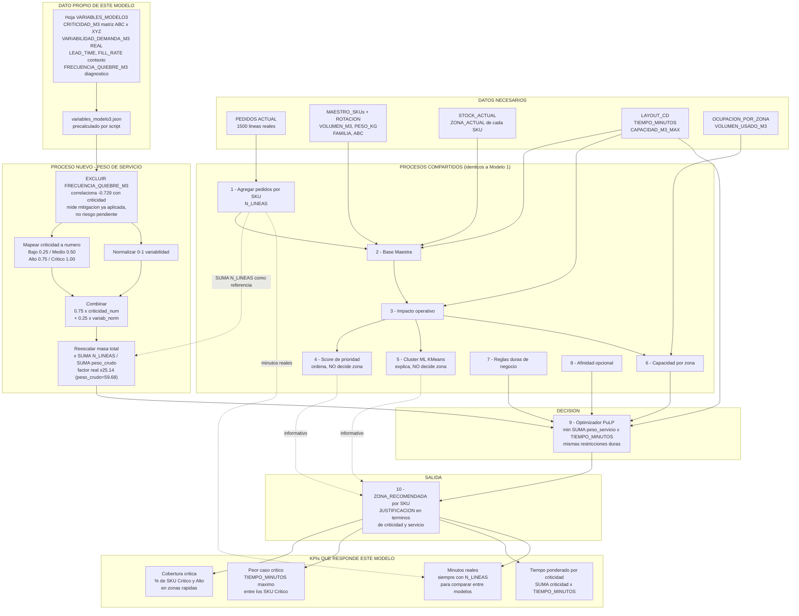

# Flujo de datos — Modelo 3 (Nivel de servicio / riesgo de quiebre)

Diseño del flujo de datos para el tercer modelo de slotting, análogo a `1.md` (velocidad) y `2.md` (valor). **Documento de diseño: todavía no está implementado.** Se apoya en la hoja `VARIABLES_MODELO3` del Excel `IMPULSA_CD_Práctico Estudiantes variables m2 -m3.xlsx`.

> **Regla que no cambia:** igual que Modelo 1 y Modelo 2, usa siempre `TIEMPO_MINUTOS` declarado en `LAYOUT_CD` (`modo_distancia = "layout_cd"`). El modo SVG queda fuera de alcance.

---

## 1. La pregunta que responde este modelo

Modelo 1 pregunta *"¿qué se pide más?"*. Modelo 2, *"¿qué vale más?"*. Modelo 3 pregunta **"¿qué SKU no me puedo dar el lujo de tener lejos cuando lo necesite?"**.

La diferencia práctica: un SKU con demanda irregular puede tener una frecuencia total moderada — no entra en el top de Modelo 1 — pero cuando sale, sale en ráfagas impredecibles y hay que reponerlo rápido. Si además es de clase A, quedarse sin él o tardar en llegar cuesta mucho más que los minutos de picking que se ahorrarían priorizando a otro. Este modelo prioriza accesibilidad y facilidad de reposición por criticidad de servicio, no por volumen de movimiento.

---

## 2. Datos de entrada — qué agrega este modelo

Las 6 tablas del lote se usan igual que en Modelo 1. La fuente nueva es la hoja `VARIABLES_MODELO3`, 100 filas (una por SKU).

| Columna | Qué es | Cómo está construida |
|---|---|---|
| `N_PEDIDOS_REAL`, `PROM_CANT_REAL`, `DESVEST_CANT_REAL` | Estadísticos de demanda | **Reales**, calculados desde `PEDIDOS ACTUAL` |
| `VARIABILIDAD_DEMANDA_M3` | Coeficiente de variación de la demanda | **Verificado: `= DESVEST_CANT_REAL / PROM_CANT_REAL`**. Es la única variable de la hoja basada en datos reales |
| `FORECAST_3M_M3` | Proyección a 3 meses | **Verificado: `≈ ROTACION_6M / 2`**, ajustado por un factor discreto de 0.95 / 1.00 / 1.05 |
| `LEAD_TIME_M3` | Días de reposición | Política por clase ABC (tabla de parámetros) |
| `FILL_RATE_OBJETIVO_M3` | Nivel de servicio objetivo | Política por clase ABC |
| `MONTHS_OF_STOCK_M3` | Meses de cobertura | Fórmula encadenada |
| `CRITICIDAD_M3` | `Bajo` / `Medio` / `Alto` / `Crítico` | Derivada de ABC cruzado con variabilidad |
| `FRECUENCIA_QUIEBRE_M3` | Quiebres esperados | Fórmula determinista encadenada |

Tabla de parámetros de la hoja (políticas de inventario por clase ABC — supuestos de industria, no políticas reales de Inchcape):

| ABC | `LEAD_TIME_DIAS` | `FILL_RATE_OBJETIVO` |
|---|---|---|
| A | 7 | 0.97 |
| B | 15 | 0.92 |
| C | 30 | 0.85 |

### 2.1 Lo que revisar los datos dejó en claro — y por qué evita construir un modelo roto

Cuatro hallazgos verificados sobre las 100 filas. El segundo es el más importante de los tres documentos.

**1. `CRITICIDAD_M3` es literalmente la matriz ABC × XYZ.** La tabla cruzada no deja dudas:

| | ABC = A | ABC = B | ABC = C |
|---|---|---|---|
| `Crítico` | 17 | 0 | 0 |
| `Alto` | 22 | 18 | 0 |
| `Medio` | 0 | 17 | 0 |
| `Bajo` | 0 | 0 | 26 |

Todos los C son `Bajo`; los A se parten entre `Crítico` (variabilidad media 0.575) y `Alto`; los B entre `Alto` y `Medio` (0.425). Es exactamente el cruce ABC-con-variabilidad que el diagnóstico de metodología señalaba como faltante en el MVP — la hoja lo trae ya calculado.

**2. ⚠️ `FRECUENCIA_QUIEBRE_M3` NO puede usarse como driver de prioridad.** Correlaciona **−0.729 (Spearman) con `CRITICIDAD_M3`** — negativo. Los números por nivel:

| Criticidad | Quiebres promedio |
|---|---|
| Crítico | 0.50 |
| Alto | 0.79 |
| Medio | 1.14 |
| Bajo | **2.22** |

Los SKU críticos quiebran **menos**, no más. La razón es lógica: la política ya los protege (lead time 7 días, fill rate 97%), así que `FRECUENCIA_QUIEBRE_M3` es un **resultado de la mitigación ya aplicada**, no un riesgo pendiente.

Y no es una tendencia: los rangos son **completamente disjuntos por clase ABC**, sin un solo solapamiento.

| ABC | Rango de `FRECUENCIA_QUIEBRE_M3` | Valores distintos |
|---|---|---|
| A | 0.4 – 0.5 | 2 |
| B | 1.1 – 1.3 | 3 |
| C | 1.9 – 2.5 | 7 |

El *nivel* de la variable está enteramente determinado por la clase ABC — la misma clase de la que se deriva `CRITICIDAD_M3`. La correlación negativa no es un hallazgo sobre el CD: es **una tautología de cómo se generó la hoja**.

**Lo que cierra el argumento**: dentro de la clase A, `FRECUENCIA_QUIEBRE_M3` correlaciona **0.864** con `VARIABILIDAD_DEMANDA_M3` — la única variable real de la hoja. La estructura es `banda(ABC) + ajuste(variabilidad real)`. Es decir, toda la información genuina que aporta **ya está en el peso**, por vía de `VARIABILIDAD_DEMANDA_M3` (la parte real) y `criticidad_num` (la banda ABC). Excluirla no pierde absolutamente nada.

Dos razones independientes, entonces, para dejarla fuera del peso: usarla cruda **invertiría el modelo** (priorizaría los clase C que el negocio decidió proteger menos, y los términos se cancelarían con r = −0.73), y además **es redundante**. **Se usa como columna de diagnóstico y como KPI de resultado, nunca como insumo del peso.**

**Cómo cambiaría con datos reales** (la objeción natural: *"¿por qué no usan la variable de quiebres en un modelo de riesgo de quiebre?"*): con quiebres observados de verdad, y no derivados de la política, la variable dejaría de ser tautológica y sería de las más valiosas — pero la forma correcta de usarla sería el **residuo**, no el nivel crudo:

```
señal = quiebres_observados − quiebres_esperados_dado_su_FILL_RATE_OBJETIVO
```

Un clase A con objetivo de 97% que igual quiebra seguido está **fallando** y merece prioridad de accesibilidad; un clase C con objetivo 85% que quiebra es comportamiento esperado, no una señal. Ese residuo sí sería un driver legítimo y se sumaría al peso sin invertir nada.

**3. `LEAD_TIME_M3` y `FILL_RATE_OBJETIVO_M3` son perfectamente colineales** (Spearman **−1.000**): las dos son funciones puras de ABC. `MONTHS_OF_STOCK_M3` va detrás (−0.988 con fill rate). Ninguna aporta información más allá de la clase ABC que ya está en `CRITICIDAD_M3`. Son contexto para mostrar, no variables para el peso.

**4. `VARIABILIDAD_DEMANDA_M3` sí aporta señal parcialmente independiente** — Spearman 0.384 contra `CRITICIDAD_M3`. Como la criticidad ya la incorpora en parte, entra al peso con ponderación baja, no como si fuera del todo nueva.

**Conclusión de diseño**: de las 8 columnas nuevas, solo **dos** deben alimentar el peso — `CRITICIDAD_M3` y `VARIABILIDAD_DEMANDA_M3`. El resto es contexto explicativo o, en el caso de `FRECUENCIA_QUIEBRE_M3`, una trampa que habría invertido el modelo.

---

## 3. Los pasos que NO cambian respecto a Modelo 1

Idénticos a los de Modelo 2 — ver la tabla en `2.md` §3, o `1.md` para el detalle completo de cada paso: agregación de pedidos, Base Maestra, impacto operativo, score de prioridad, cluster ML, capacidad, reglas de negocio, afinidad y armado de la recomendación final. **Lo único que cambia es el peso del optimizador y el KPI de cabecera.**

---

## 4. El paso nuevo — construir el peso de servicio

**Función nueva propuesta**: `app/dominio/objetivo_servicio.py::peso_servicio`.

### 4.1 Fórmula del peso

```
criticidad_num(SKU) = {Bajo: 0.25, Medio: 0.50, Alto: 0.75, Crítico: 1.00}
variab_norm(SKU)    = normalizar_01(VARIABILIDAD_DEMANDA_M3)

peso_servicio_crudo(SKU) = 0.75 · criticidad_num + 0.25 · variab_norm
```

- **Dos términos, no cuatro** — por §2.1: `FRECUENCIA_QUIEBRE_M3` está excluida deliberadamente (invertiría el modelo), y `LEAD_TIME`/`FILL_RATE`/`MONTHS_OF_STOCK` son colineales con ABC, que `criticidad_num` ya representa.
- Los pesos 0.75/0.25 son configurables (mismo patrón que `PESOS_SCORE`). La ponderación baja de variabilidad refleja que la criticidad **ya la incorpora parcialmente** (r = 0.384) — subirla sería contar dos veces la misma señal.
- El mapeo de `criticidad_num` es lineal a propósito (0.25 / 0.50 / 0.75 / 1.00). Si el negocio considera que la diferencia entre `Crítico` y `Alto` es mucho mayor que entre `Medio` y `Bajo`, se puede hacer convexo (ej. 0.1 / 0.3 / 0.6 / 1.0) — es una decisión de política, no técnica, y por eso vive en `config.py`, no en el código de dominio.

### 4.2 Normalización de escala — obligatoria, misma dirección que Modelo 2

| Peso | Rango | Suma total |
|---|---|---|
| `N_LINEAS` (Modelo 1) | 6 a 27 | **1 500** |
| `peso_servicio_crudo` (Modelo 3, de §4.1) | ~0.19 a 1.00 | **59.68** (verificado: `Σ criticidad_num = 62.0` exacto — 17·1.00 + 40·0.75 + 17·0.50 + 26·0.25 — más el aporte de `variab_norm`) |

`peso_servicio_crudo` se queda corto frente a la masa de referencia de Modelo 1 — **igual que `peso_valor_crudo` de Modelo 2** (37.22, ver `2.md` §4.3): los dos modelos nuevos quedan por debajo de 1 500, no uno arriba y otro abajo. Sin reescalar, `PESO_AFINIDAD_FORZADO = 60.0` **dominaría casi por completo la función objetivo** (60 contra una masa total de ~60), y el botón "Forzar afinidad" dejaría de ser una preferencia suave para volverse casi una restricción de facto.

Misma solución que en Modelo 2 — igualar la masa total, con el **factor real ×25.14**, verificado sobre el lote:

```
peso_servicio(SKU) = peso_servicio_crudo(SKU) × ( Σ N_LINEAS / Σ peso_servicio_crudo )
                    = peso_servicio_crudo(SKU) × ( 1500 / 59.68 )
                    = peso_servicio_crudo(SKU) × 25.14
```

(Ver `1.md` §12 para los dos factores —×40.30 en Modelo 2, ×25.14 acá— juntos y el argumento completo de por qué van en la misma dirección.)

### 4.3 De dónde salen estos datos en runtime

Idéntico patrón a Modelo 2:

```
scripts/extraer_variables_modelo.py   (lee VARIABLES_MODELO3 con header=11)
        ▼
backend/data/variables_modelo3.json   {"SKU00001": {"CRITICIDAD_M3": "Crítico", "VARIABILIDAD_DEMANDA_M3": 0.593, ...}}
        ▼
app/dominio/objetivo_servicio.py::peso_servicio
```

Igual que en Modelo 2: SKU del lote que no esté en el JSON ⇒ error explícito, nunca un peso 0 silencioso.

**Nota**: `VARIABILIDAD_DEMANDA_M3` se podría recalcular en vivo desde `pedidos` (es solo `DESVEST/PROM` de `CANTIDAD` agrupado por SKU) en vez de leerla del JSON — sería la opción correcta a futuro, porque se recalcularía sola con cada lote nuevo en vez de quedar congelada. Para la entrega, leerla del JSON mantiene la trazabilidad exacta con la hoja entregada.

---

## 5. El optimizador (paso 9) — qué cambia exactamente

Igual que en Modelo 2, **una sola línea**:

```
Modelo 1:  costo_picking = Σ N_LINEAS(SKU)        × TIEMPO_MINUTOS(zona) × x[SKU][zona]
Modelo 2:  costo_picking = Σ peso_valor(SKU)      × TIEMPO_MINUTOS(zona) × x[SKU][zona]
Modelo 3:  costo_picking = Σ peso_servicio(SKU)   × TIEMPO_MINUTOS(zona) × x[SKU][zona]
```

Restricciones duras, penalización de movimiento y término de afinidad: **sin cambios** en los tres modelos. Mismo parámetro `modo_objetivo: "velocidad" | "valor" | "servicio"`.

### 5.1 Lo que este modelo NO hace (y conviene aclararlo)

El nombre "nivel de servicio" puede sugerir que hay un SLA modelado. **No lo hay.** Este modelo solo cambia la *prioridad* con la que un SKU compite por las zonas cercanas — no agrega ninguna restricción del tipo *"todo SKU Crítico debe estar sí o sí en una zona de menos de 3 minutos"*.

Eso último sería perfectamente implementable con la maquinaria que ya existe (una regla de atributo: `CRITICIDAD_M3 == "Crítico"` → `zona_prohibida` para las zonas lentas), y sería un buen paso siguiente. Pero es una decisión de negocio — una restricción dura puede volver el problema infactible si no hay capacidad suficiente en zonas rápidas — así que no se asume por defecto.

---

## 6. Salida por SKU (paso 10)

Mismas columnas que Modelo 1, más las de este modelo:

- `CRITICIDAD_M3`, `VARIABILIDAD_DEMANDA_M3` (los insumos del peso).
- `FRECUENCIA_QUIEBRE_M3`, `LEAD_TIME_M3`, `FILL_RATE_OBJETIVO_M3`, `MONTHS_OF_STOCK_M3` (contexto — se muestran, no deciden).
- `PESO_SERVICIO` (el peso normalizado que efectivamente usó el optimizador).

`JUSTIFICACION` propia del modelo:

> *"Mover de 7. MEZANNINE a 5. RACK SIMPLE. Criticidad Crítico (clase A, variabilidad de demanda 0.59 — alta). Lead time de reposición 7 días, fill rate objetivo 97%. Gana ubicación accesible por riesgo de servicio, aunque su frecuencia de picking (11 líneas) no esté en el top del catálogo."*

Nótese que la justificación **menciona explícitamente la frecuencia** para dejar claro el trade-off: este SKU se acerca a pesar de no ser de los más pedidos. Es justamente lo que diferencia esta propuesta de la de Modelo 1.

---

## 7. KPIs — los propios de este modelo

Mismo principio que en Modelo 2 (`2.md` §7): **los KPIs en minutos se siguen calculando con `N_LINEAS` en los tres modelos**, porque miden tiempo físico real de operación. Y este modelo agrega los suyos:

- **Cobertura crítica**: % de SKU `Crítico` + `Alto` ubicados en el tercio de zonas más rápidas, hoy vs. propuesta. Es el KPI de cabecera.
- **Tiempo de acceso ponderado por criticidad**: `Σ criticidad_num × TIEMPO_MINUTOS(zona)`, hoy vs. propuesta.
- **Peor caso crítico**: el `TIEMPO_MINUTOS` máximo entre todos los SKU `Crítico` — un promedio bueno puede esconder un SKU crítico olvidado en la peor zona, y este KPI lo expone.
- **Diagnóstico (no objetivo)**: `FRECUENCIA_QUIEBRE_M3` promedio de los SKU en zonas rápidas vs. lentas — se reporta para mostrar la relación, dejando claro que es consecuencia de la política de inventario, no algo que este modelo optimice (§2.1).

El trade-off a decir en voz alta: *"Modelo 3 sacrifica X% de ahorro de tiempo total para subir de Y% a Z% la proporción de SKU críticos en zonas de acceso rápido."*

---

## 8. Flujo completo, de un vistazo



**Qué pregunta responde este modelo**: *¿qué proporción de los SKU que no me puedo dar el lujo de tener lejos quedan efectivamente accesibles, y cuál es el peor caso que queda sin cubrir?*

---

## 9. ¿Va a dar una propuesta realmente distinta? — verificado

Comprobado sobre los 100 SKU del lote real:

| Correlación con `N_LINEAS` (peso de Modelo 1) | Pearson | Spearman |
|---|---|---|
| `CRITICIDAD_M3` (numérica) | −0.037 | −0.029 |
| `VARIABILIDAD_DEMANDA_M3` | −0.092 | −0.074 |
| `FRECUENCIA_QUIEBRE_M3` | −0.003 | −0.037 |

**Solapamiento del TOP 20**: entre el TOP 20 por `N_LINEAS` y el TOP 20 por criticidad comparten **3 de 20 SKU**; por variabilidad, también 3 de 20.

Conclusión: sí, la propuesta sería genuinamente distinta. Con un matiz interesante que Modelo 2 no tiene — acá **una de las dos variables del peso (`VARIABILIDAD_DEMANDA_M3`) es real**, calculada desde los pedidos, así que su independencia respecto de `N_LINEAS` no es un artefacto del ruido sintético: **es un hallazgo real sobre el dataset**. Que un SKU se pida seguido y que se pida de forma predecible son, efectivamente, dos cosas distintas en estos pedidos.

---

## 10. Limitaciones que hay que decir en voz alta

- **Es el modelo con más dato real de los tres nuevos, pero sigue siendo mixto.** `VARIABILIDAD_DEMANDA_M3` sale de pedidos reales; `LEAD_TIME`/`FILL_RATE` son estándares de industria por clase ABC, **no las políticas reales de Inchcape/CD Aldeas**.
- **`CRITICIDAD_M3` depende de la clase ABC declarada en el Excel.** El proyecto ya documentó que ABC no explica por sí sola la carga ni el ahorro (χ² ABC vs. `ZONA_ACTUAL`, p = 0.646). Como `criticidad_num` pesa 0.75 en el peso, este modelo hereda esa limitación.
- **`FRECUENCIA_QUIEBRE_M3` está deliberadamente fuera del peso** — por dos razones independientes: invertiría el modelo y además es redundante. El desarrollo completo, con los rangos disjuntos por ABC y la forma correcta de usarla con datos reales (el residuo contra el fill rate objetivo), está en §2.1. Es la pregunta más probable en una defensa; conviene tener ese apartado a mano.
- **No hay SLA modelado** (§5.1): esto prioriza, no garantiza.
- **`FORECAST_3M_M3` no se usa en ningún cálculo** de este diseño — es `ROTACION_6M/2` con un ajuste de ±5%, así que no aporta nada que `ROTACION_6M` no tenga ya. Se puede mostrar como contexto, pero no sostiene ninguna decisión. (La propia hoja señala que ésta sería la variable con mayor potencial de ML real — ARIMA/Prophet en vez de una regla lineal — si en el futuro hubiera histórico mensual.)
