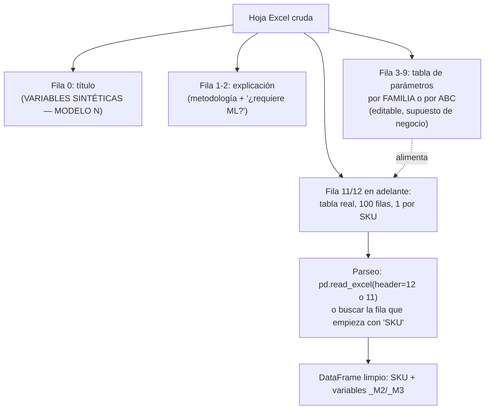
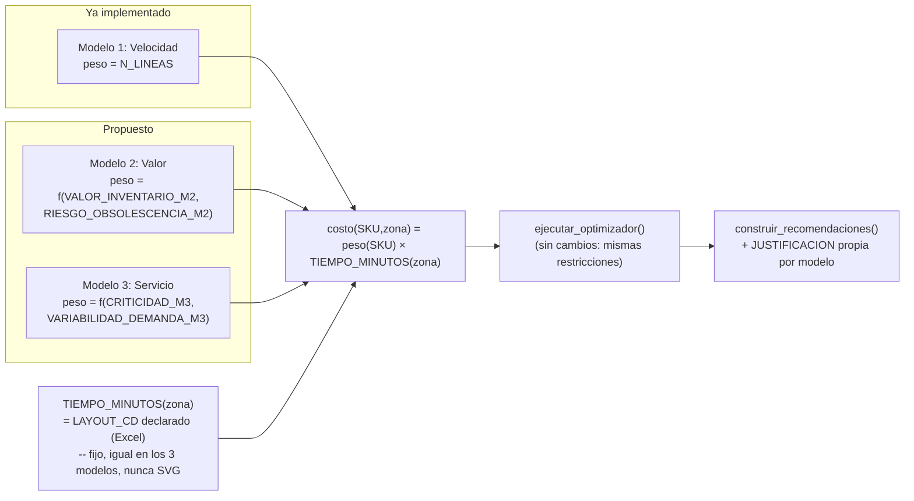
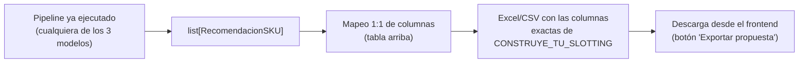

# Diagnóstico y plan — Modelo 2 (valor/rentabilidad) y Modelo 3 (nivel de servicio)

Análisis de las dos hojas nuevas en `data/IMPULSA_CD_Práctico Estudiantes variables m2 -m3.xlsx` (`VARIABLES_MODELO2`, `VARIABLES_MODELO3`) y plan de cómo integrarlas al pipeline existente como dos modos de slotting adicionales al que ya corre hoy (llamado aquí "Modelo 1" para poder compararlos). Es un documento de **diseño, no de implementación** — no se tocó código de la app para armarlo.

> **Decisión ya tomada (aclaración del usuario, no abierta a debate):** el modo `svg` (distancia real medida sobre el layout escaneado, ver `OPTIMIZACION-DISTANCIA-SVG.md`) **no se usa para esta comparación de 3 modelos** — no se quiere manejar una distancia distinta por zona entre modelos. **Los 3 modelos trabajan siempre con `TIEMPO_MINUTOS` tal cual lo declara el Excel en `LAYOUT_CD`** (`modo_distancia = "layout_cd"`, el default de siempre). El modo SVG sigue existiendo en el código para Modelo 1 como feature aparte, pero queda fuera del alcance de este diagnóstico y no se combina con Modelo 2/3.

---

## 1. Qué hay hoy (Modelo 1, ya implementado)

El optimizador (`backend/app/dominio/optimizador.py`) resuelve, por SKU, a qué zona asignarlo minimizando:

```
costo(SKU, zona) = N_LINEAS(SKU) × TIEMPO_MINUTOS(zona)
```

`N_LINEAS` es la frecuencia real de picking (líneas de pedido reales en `PEDIDOS ACTUAL`, no la `ROTACION_6M` declarada — no correlacionan, Pearson 0.028). Es **puro slotting por velocidad**: al SKU que más se pide, la zona más cercana. `TIEMPO_MINUTOS(zona)` puede salir de dos fuentes distintas hoy (`modo_distancia`: Excel declarado o distancia real medida sobre el SVG escaneado — ver `OPTIMIZACION-DISTANCIA-LAYOUT-CD.md`/`OPTIMIZACION-DISTANCIA-SVG.md`), pero **para Modelo 2 y 3 esa variante queda descartada** (ver nota arriba): siempre Excel declarado.

Modelo 2 y 3 no cambian la mecánica del optimizador ni la fuente de `TIEMPO_MINUTOS` — cambian únicamente **qué prioriza** el peso de cada SKU en esa misma cuenta.

## 2. Las hojas nuevas — diagnóstico estructural

Ambas hojas están pensadas para lectura humana, no para ingesta directa: título fusionado, párrafo explicativo, una tabla chica de parámetros de negocio, y recién después la tabla real de 100 SKUs.



No hace falta tocar `/ingesta` ni el mapeo configurable (`app/ingesta/mapeo.py`) para esto — esas dos hojas no son parte de las 6 tablas del lote operativo (`TABLAS_LOTE`), son un dataset de apoyo paralelo, igual en espíritu a `distancia_svg_por_zona.json` (un JSON derivado una vez, no una tabla que llega en cada carga).

### 2.1 `VARIABLES_MODELO2` — valor / rentabilidad

| Columna | Origen | Uso propuesto |
|---|---|---|
| `COSTO_UNITARIO_M2` | `COSTO_BASE` por familia + ajuste tamaño/peso ±10% ruido | Referencia, no entra directo al objetivo |
| `MARGEN_%_M2` | `MARGEN_BASE` por familia ±10% ruido | Prioriza cercanía (a mayor margen, más "premium" la ubicación) |
| `VALOR_INVENTARIO_M2` | `COSTO_UNITARIO_M2 × cantidad en stock` (aprox.) | **Peso principal** del objetivo — reemplaza a `N_LINEAS` |
| `AGED_STOCK_DIAS_M2` | Antigüedad simulada vs. `AGED_MAX_DIAS` por familia | Modula el peso: castiga SKUs envejecidos |
| `RIESGO_OBSOLESCENCIA_M2` | Bajo/Medio/Alto, derivado de `AGED_STOCK_DIAS_M2` | Empuja a zonas de menor costo (rack alto/mezzanine) |

100% determinista por reglas (VLOOKUP + IF por familia/ABC), la propia hoja lo dice explícitamente — no hay ML involucrado y no hace falta agregarlo para este ejercicio.

### 2.2 `VARIABLES_MODELO3` — nivel de servicio / riesgo de quiebre

| Columna | Origen | Uso propuesto |
|---|---|---|
| `VARIABILIDAD_DEMANDA_M3` | **Real**: `DESVEST_CANT_REAL / PROM_CANT_REAL` de `PEDIDOS ACTUAL` | Señal real, no sintética |
| `FORECAST_3M_M3` | Proyección lineal simple (regla, no ML) | Contexto, no entra directo al objetivo |
| `LEAD_TIME_M3` / `FILL_RATE_OBJETIVO_M3` | Política por clase ABC (tabla de parámetros) | Contexto de servicio esperado |
| `CRITICIDAD_M3` | Bajo/Medio/Alto/Crítico, derivado de ABC + variabilidad | **Peso principal** del objetivo |
| `FRECUENCIA_QUIEBRE_M3` | Fórmula determinista encadenada | Refuerzo del peso de criticidad |

Aquí sí hay una variable real medida (`VARIABILIDAD_DEMANDA_M3`), el resto es política de negocio (parámetros por ABC), igual de legítimo para el ejercicio pero distinto en "qué tan sintético" es cada número — vale la pena distinguirlo al presentar.

## 3. Cómo entrarían al optimizador (mismo patrón que `modo_distancia`)

La forma más chica de implementar esto es análoga a como ya está armado el selector `modo_distancia`, pero **sin usar la variante SVG de esa lógica** (ver nota al inicio del documento): **no tocar las restricciones duras** (capacidad, tope de movimientos, reglas de atributo, incompatibilidad de familias siguen igual en los 3 modelos), solo cambiar qué peso por SKU multiplica `TIEMPO_MINUTOS(zona)` en el objetivo — y `TIEMPO_MINUTOS(zona)` siempre sale de `LAYOUT_CD` declarado, fijo, sin importar el modelo.



Un parámetro nuevo `modo_objetivo: "velocidad" | "valor" | "servicio"` en `SolicitudPipeline` y `ejecutar_pipeline`, independiente de `modo_distancia` (que para esta comparación queda fijo en `"layout_cd"`, nunca `"svg"`), que decide qué diccionario `{SKU: peso}` se pasa a `ejecutar_optimizador` en vez de `frecuencia_sku`. El resto del pipeline (ML, reglas, capacidad, KPIs) no cambia.

**Decisión pendiente (para el usuario, no técnica):** ¿selector único (correr un modelo a la vez, como hoy con `modo_distancia`) o correr los 3 en paralelo para comparar 3 propuestas a la vez en la misma pantalla? La segunda es más cara (3x el solver) pero es justo lo que pide "proponer 3 modelos" para una comparación en vivo.

### 3.1 Punto abierto: normalización del peso

`N_LINEAS` (Modelo 1) está en unidades de "visitas". `VALOR_INVENTARIO_M2` está en soles y puede tener una escala completamente distinta (cientos vs. decenas de miles). Si se usa el valor crudo como peso, el objetivo quedaría dominado por magnitud de sol y no por prioridad relativa. Antes de implementar, normalizar cada peso a [0,1] (igual que ya hace `scoring.py::normalizar_01` para el score de prioridad) para que los 3 modelos sean comparables entre sí y el resultado no dependa de la escala arbitraria de la variable elegida.

### 3.2 Dónde vivirían estos datos

No hace falta una tabla SQL nueva ni tocar `/ingesta`: igual que `backend/data/distancia_svg_por_zona.json`, un script (`scripts/extraer_variables_modelo.py`, análogo a `calcular_distancia_svg_zonas.py`) parsea las dos hojas una vez y guarda `backend/data/variables_modelo2.json` / `variables_modelo3.json` (`{SKU: {...}}`). Se regenera solo si cambia el Excel de origen — mismo patrón, cero infraestructura nueva.

## 4. Los 3 modelos, uno al lado del otro

| | Modelo 1 (hoy) | Modelo 2 (valor) | Modelo 3 (servicio) |
|---|---|---|---|
| Pregunta que responde | ¿Qué se pide más? | ¿Qué vale más tener a mano? | ¿Qué no me puedo dar el lujo de no tener a mano? |
| Peso principal | `N_LINEAS` (real) | `VALOR_INVENTARIO_M2` (sintético) | `CRITICIDAD_M3` (mixto) |
| Penaliza | — | Stock envejecido (`RIESGO_OBSOLESCENCIA_M2`) | Baja disponibilidad (`FRECUENCIA_QUIEBRE_M3`) |
| ¿Requiere ML? | No | No (reglas deterministas) | No para este ejercicio (forecast es lineal) |
| Dato real vs. sintético | 100% real | 100% sintético (parámetros editables) | Mixto (variabilidad real + política ABC) |

### 4.1 Dónde se nota la diferencia en la práctica

Las restricciones (capacidad por zona, tope de movimientos) son las mismas en los 3 modelos, y las zonas cercanas son un recurso escaso — así que la diferencia real entre modelos aparece en **cuál SKU se queda con esas zonas** cuando dos SKUs compiten por el mismo espacio prime:

| SKU (ejemplo) | Modelo 1 (velocidad) | Modelo 2 (valor) | Modelo 3 (servicio) |
|---|---|---|---|
| Repuesto caro, se pide poco | Zona lejana (baja `N_LINEAS`) | **Zona cercana** (alto `VALOR_INVENTARIO_M2`) | Depende de su ABC/criticidad |
| Repuesto barato, se pide mucho y siempre igual | **Zona cercana** (alta `N_LINEAS`) | Zona lejana (bajo valor) | Zona lejana (baja variabilidad → bajo riesgo de quiebre) |
| Repuesto de demanda errática, riesgo de quiebre alto | Zona media (frecuencia moderada) | Zona media (valor moderado) | **Zona cercana** (alta `VARIABILIDAD_DEMANDA_M3`/`CRITICIDAD_M3`) |
| Stock viejo con riesgo de obsolescencia | Zona media (según su `N_LINEAS`) | **Zona lejana/mezzanine** (empuje explícito por `RIESGO_OBSOLESCENCIA_M2`) | Zona media (no interviene) |

Solo Modelo 2 tiene una fuerza que **aleja** SKUs de las zonas buenas (`RIESGO_OBSOLESCENCIA_M2`); Modelo 1 y 3 solo acercan según su prioridad, nunca alejan explícitamente. Esto significa que la propuesta de Modelo 2 puede mover SKUs a zonas peores que hoy incluso sin que ningún SKU "mejor" los haya desplazado — solo por su propio riesgo de obsolescencia.

## 5. Exportar la propuesta con la plantilla `CONSTRUYE_TU_SLOTTING`

La hoja `CONSTRUYE_TU_SLOTTING` del Excel de práctica ya es, columna por columna, casi un calco de lo que ya calcula `RecomendacionSKU` — el mapeo es directo, sin inventar nada:

| Columna plantilla | Viene de `RecomendacionSKU` |
|---|---|
| `SKU` | `SKU` |
| `MARCA` | `MARCA` |
| `FAMILIA` | `FAMILIA` |
| `ROT_6M` | `ROTACION_6M` |
| `VOL_M3` | `VOLUMEN_M3` |
| `PESO_KG` | `PESO_KG` |
| `ZONA_ACTUAL` | `ZONA_ACTUAL` |
| `TIEMPO_HOY_MIN` | `TIEMPO_LAYOUT_ACTUAL` |
| `MI_LOGICA` | **nuevo**: nombre del modelo usado (`"Modelo 1: Velocidad"` / `"Modelo 2: Valor"` / `"Modelo 3: Servicio"`) |
| `ZONA_NUEVA` | `ZONA_RECOMENDADA` |
| `TIEMPO_NUEVO_MIN` | `TIEMPO_NUEVO_MIN` |
| `JUSTIFICACION` | `JUSTIFICACION` (ya la arma `recomendaciones.py::_generar_justificacion`, solo hace falta una versión de ese texto por modelo — hoy explica en términos de visitas/minutos, en Modelo 2/3 debería mencionar valor/riesgo o criticidad/quiebre) |

Como cada fila de `RecomendacionSKU` ya trae **hoy y propuesta juntos** (`ZONA_ACTUAL`+`TIEMPO_LAYOUT_ACTUAL` vs. `ZONA_RECOMENDADA`+`TIEMPO_NUEVO_MIN`), la comparación "hoy vs. propuesta" no requiere una hoja aparte ni un merge — es la misma fila.



Implementación mínima: un endpoint (`GET /pipeline/exportar?modo_objetivo=...`) que tome las recomendaciones ya calculadas y las escriba con `pandas.DataFrame.to_excel` usando exactamente esos 12 nombres de columna — no hace falta una librería nueva, `pandas`+`openpyxl` ya están en el proyecto (se usan en `/ingesta`).

## 6. Limitaciones honestas (léelas antes de presentar)

- **Modelo 2 es 100% sintético en su variable principal.** `VALOR_INVENTARIO_M2` no es costo/margen real de Inchcape — son supuestos de negocio editables por familia. Presentarlo como "aproximación ilustrativa de cómo cambiaría el slotting si tuviéramos costo real", no como dato de la empresa.
- **Modelo 3 mezcla una señal real con política simulada.** `VARIABILIDAD_DEMANDA_M3` sí sale de pedidos reales; `LEAD_TIME_M3`/`FILL_RATE_OBJETIVO_M3` son políticas típicas de industria, no las políticas reales de Inchcape/CD Aldeas.
- **Los 3 modelos comparten el mismo optimizador y las mismas restricciones duras** — la diferencia es solo el criterio de prioridad. Esto es una ventaja (fácil de mantener, resultado siempre factible) pero también significa que no hay una verdadera "restricción de servicio" (ej. SLA de picking) en Modelo 3, solo una prioridad más fuerte de estar cerca.
- **Sin normalizar el peso (§3.1), comparar los 3 modelos no es justo** — hay que resolver eso antes de mostrar los 3 lado a lado, o la magnitud de la mejora reportada no sería comparable entre modelos.
