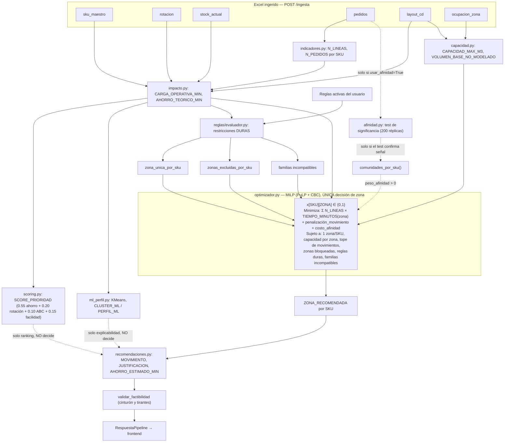
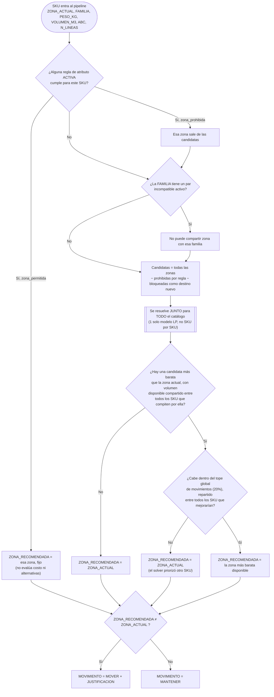

# Cómo se evalúa y decide el slotting — proceso completo

> Documento generado para dar contexto completo a una nueva conversación (2026-09-02), verificado línea por línea contra el código real de `backend/app/dominio/`. Complementa a `RESUMEN-PROYECTO.md` (la vista de todo el proyecto) -- este archivo es exclusivamente el algoritmo de decisión.

## 1. Resumen ejecutivo

La decisión de "a qué zona va cada SKU" la toma **un solo mecanismo**: un modelo de **Programación Lineal Entera (MILP)**, resuelto con PuLP + solver CBC, en `backend/app/dominio/optimizador.py`. Minimiza el **tiempo total de picking real** (líneas de pedido × tiempo de acceso de la zona), sujeto a restricciones duras de capacidad, reglas de negocio y un tope de movimientos.

**Todo lo demás que el pipeline calcula (score ponderado, clustering ML, afinidad de pedidos) es explicabilidad/priorización para el humano o un término *opcional* del objetivo -- nada de eso puede, por sí solo, decidir la zona sin pasar por ese único modelo.** Esta distinción es la fuente de confusión más común al leer el proyecto, así que se repite en varios puntos de este documento con evidencia de código.

## 2. Las 6 tablas de entrada (recordatorio, detalle completo en `RESUMEN-PROYECTO.md` §4)

`sku_maestro`, `rotacion`, `stock_actual`, `pedidos`, `layout_cd`, `ocupacion_zona`. Todas viven en SQLite tras `POST /ingesta`, se leen frescas en cada `POST /pipeline/ejecutar` (`leer_tablas_lote()`, sin caché entre requests).

## 3. El pipeline completo, fase por fase

Orquestado por `dominio/pipeline.py::ejecutar_pipeline()` -- este archivo **no calcula nada él mismo**, solo encadena las funciones de los demás módulos en orden fijo:

### Fase 3 -- `indicadores.py::construir_pedidos_por_sku()`
Agrega la tabla `pedidos` (nivel línea) a nivel SKU:
- `N_LINEAS` = cantidad de líneas de pedido del SKU (**la métrica de velocidad real** -- ver §9, por qué no se usa `ROTACION_6M`).
- `N_PEDIDOS` = pedidos distintos en que aparece.
- `CANT_TOTAL`, `CANT_PROMEDIO`, `UNIDADES_POR_PEDIDO`.

### Fase 4 -- `impacto.py::construir_base_maestra()`
Integra por `SKU`/`ZONA_ACTUAL`: `sku_maestro` + `rotacion` + `stock_actual` + indicadores de pedidos + `layout_cd` (renombrado a `TIEMPO_LAYOUT_ACTUAL`, `DISTANCIA_ACTUAL_M`, `CAPACIDAD_ZONA_ACTUAL`). Valida en duro (no en silencio): SKU duplicado, SKU sin `ZONA_ACTUAL`, o `ZONA_ACTUAL` que no existe en `layout_cd` → `BaseMaestraInvalidaError`.

### Fase 5-6 -- `impacto.py::calcular_impacto_operativo()`
```
CARGA_OPERATIVA_MIN = N_LINEAS × TIEMPO_LAYOUT_ACTUAL
AHORRO_TEORICO_MIN  = N_LINEAS × (TIEMPO_LAYOUT_ACTUAL − tiempo_mínimo_del_CD)   [nunca negativo]
```
`tiempo_mínimo_del_CD` = el menor `TIEMPO_MINUTOS` entre todas las zonas de `layout_cd` -- techo teórico de ahorro, **no una zona destino garantizada** (lo aclara el propio código: puede no ser factible por capacidad/reglas).

### Fase 7 -- `scoring.py::calcular_score_prioridad()` — ranking, NO decide zona
```
AHORRO_NORM            = minmax(AHORRO_TEORICO_MIN)
ROTACION_NORM          = minmax(ROTACION_6M)
VOLUMEN_NORM           = minmax(VOLUMEN_M3)
FACILIDAD_MOVIMIENTO   = 1 − VOLUMEN_NORM
ABC_SCORE              = {A: 1.00, B: 0.60, C: 0.30}[ABC]

SCORE_PRIORIDAD = 100 × (0.55·AHORRO_NORM + 0.20·ROTACION_NORM + 0.10·ABC_SCORE + 0.15·FACILIDAD_MOVIMIENTO)
RANKING_SCORE   = rank descendente de SCORE_PRIORIDAD
```
Pesos en `core/config.py::PESOS_SCORE`, ajustables por request (deben sumar 1.0, se valida explícito). **Verificado por código: `optimizador.py` nunca lee `SCORE_PRIORIDAD` ni `RANKING_SCORE`.** Su único uso real hoy: columna "Score" y orden por defecto de la tabla SKU·Slotting del frontend (`SkuSlottingView.tsx`).

### Fase 9 -- `capacidad.py::calcular_capacidad()`
```
VOLUMEN_MUESTRA_ACTUAL     = Σ VOLUMEN_M3 de los SKU de la muestra ya en esa zona (agrupado por ZONA_ACTUAL)
VOLUMEN_BASE_NO_MODELADO   = max(0, VOLUMEN_USADO_M3_reportado − VOLUMEN_MUESTRA_ACTUAL)   # evita contar 2 veces
USO_MODELO_ACTUAL_%        = 100 × VOLUMEN_USADO_M3 / CAPACIDAD_MAX_M3
```
`VOLUMEN_BASE_NO_MODELADO` es lo que el optimizador reserva como "ya ocupado por algo fuera de la muestra" al calcular capacidad disponible (§5).

### Motor de reglas -- `reglas/evaluador.py`
Corre sobre `base_maestra` (con score y ML ya pegados) antes del optimizador:
- **Reglas de atributo** (`aplicar_reglas_atributo`): por cada SKU, evalúa TODAS las reglas activas contra `campo`/`operador`/`valor`. Si cumple y la regla trae `zona_permitida` → `zona_unica_por_sku[SKU] = zona` (si dos reglas aplican, **gana la última evaluada**, sin prioridad explícita -- riesgo real si se crean reglas solapadas). Si trae `zona_prohibida` → se **acumula** en `zonas_excluidas_por_sku[SKU]`.
- **Reglas de incompatibilidad** (`pares_familias_incompatibles`): pares de familias que no pueden compartir zona (`modo="misma_zona_prohibida"`, único modo implementado hoy).

Estas salidas se pasan al optimizador como **restricciones duras** (variables fijadas 0/1), nunca como término del objetivo.

### Fase 10-11 -- `optimizador.py::ejecutar_optimizador()` — EL MOTOR DE DECISIÓN

Ver detalle completo en §4-5 más abajo (es el corazón del documento).

### Fase 12,14 -- `recomendaciones.py`
```python
ZONA_RECOMENDADA = zona_asignada[SKU]          # lo que resolvió el optimizador
TIEMPO_NUEVO_MIN = TIEMPO_MINUTOS[ZONA_RECOMENDADA]
COSTO_ACTUAL_MIN = N_LINEAS × TIEMPO_LAYOUT_ACTUAL
COSTO_NUEVO_MIN  = N_LINEAS × TIEMPO_NUEVO_MIN
AHORRO_ESTIMADO_MIN = COSTO_ACTUAL_MIN − COSTO_NUEVO_MIN
MOVIMIENTO       = "MOVER" si ZONA_ACTUAL != ZONA_RECOMENDADA, si no "MANTENER"
JUSTIFICACION    = texto generado (ver plantilla en §8)
```
`validar_factibilidad()` (Fase 14) **repite** -- sobre el resultado ya extraído -- las mismas 3 comprobaciones duras que el optimizador ya garantiza (capacidad por zona, tope de movimientos, ninguna zona nula): "cinturón y tirantes". Si falla acá, es un bug en `optimizador.py`, nunca un caso de negocio válido -- lanza `FactibilidadError` (409).

### Fase 13 -- `kpis.py::calcular_kpis()`
Agregados sobre el resultado final: tiempo total actual vs. optimizado, % de reducción, productividad (líneas/hora-hombre), tiempo promedio **por pedido** (no por línea -- error de método frecuente ya documentado).

### Fase 18-23 -- `ml_perfil.py::calcular_ml_perfil()` — explicabilidad, NO decide zona

```
variables = [ROTACION_6M, N_LINEAS, N_PEDIDOS, CANT_TOTAL, VOLUMEN_M3, PESO_KG,
             TIEMPO_LAYOUT_ACTUAL, CARGA_OPERATIVA_MIN, AHORRO_TEORICO_MIN]
             (se descartan automáticamente las que no varíen en el lote)
X_scaled = StandardScaler().fit_transform(X)
k óptimo = argmax(silhouette_score) para k en [2, 8]
KMeans(k óptimo).fit(X_scaled) → CLUSTER_ML por SKU
```
Por cluster: `INDICE_IMPACTO_CLUSTER` = promedio de 4 variables normalizadas (`CARGA_OPERATIVA_MIN`, `AHORRO_TEORICO_MIN`, `N_LINEAS`, `ROTACION_6M`), rankeado → `PRIORIDAD_CLUSTER_RANK` → etiqueta `PERFIL_ML` ("Impacto alto/medio/bajo"). Se **reentrena en cada corrida** del pipeline (no carga un `.joblib` fijo) -- así escala sin recalibrar a mano.

**Verificado por código: `optimizador.py` nunca lee `CLUSTER_ML` ni `PERFIL_ML`.** Su uso real: panel de explicabilidad por SKU (`GET /recomendaciones/{sku}` → `explicar_sku()`, 4 piezas: contribución al cuadrado por variable, distancia a centroide propio vs. 2º más cercano, flag `asignacion_ambigua`, silhouette individual) y, desde esta sesión, columna "Perfil ML" en la tabla del frontend.

### Bloque E -- `afinidad.py` — opcional, gateado por significancia, ver §7

## 4. Diagrama del pipeline completo



## 5. El optimizador en profundidad (`dominio/optimizador.py`)

**Variable de decisión:** `x[sku][zona] ∈ {0, 1}` para CADA combinación SKU×Zona (binaria, PuLP).

**Función objetivo (minimizar):**
```
Σ_sku Σ_zona  N_LINEAS[sku] × TIEMPO_MINUTOS[zona] × x[sku][zona]      ← costo_picking (el término dominante)
+ Σ_sku Σ_zona≠zona_actual  PENALIZACION_MOVIMIENTO × x[sku][zona]      ← costo_movimientos (hoy = 0)
+ peso_afinidad × Σ_comunidad Σ_zona  p[comunidad][zona]                ← costo_afinidad (opcional, ver §7)
```

**Restricciones (todas duras, ninguna es "sugerencia"):**

1. **Una zona por SKU:** `Σ_zona x[sku][zona] = 1` para cada SKU.
2. **Capacidad por zona:** `VOLUMEN_BASE_NO_MODELADO[zona] + Σ_sku VOLUMEN_M3[sku]·x[sku][zona] ≤ CAPACIDAD_MAX_M3[zona]`.
3. **Tope de movimientos:** `Σ_{sku,zona≠zona_actual} x[sku][zona] ≤ max_movimientos`, donde `max_movimientos = max(1, round(n_SKU × porcentaje_max_movimiento))` (20% por defecto, `core/config.py::PORCENTAJE_MAX_MOVIMIENTO`, ajustable por request).
4. **Zonas bloqueadas como destino nuevo** (`ZONAS_NO_DESTINO`, vacío por defecto): un SKU ya presente en esa zona puede quedarse, pero ningún SKU nuevo puede entrar.
5. **Regla de atributo -- zona forzada:** `x[sku][zona_forzada] = 1` (el SKU no compite por costo, va directo ahí).
6. **Regla de atributo -- zona prohibida:** `x[sku][zona_prohibida] = 0`.
7. **Familias incompatibles:** variable auxiliar `y[familia][zona] ∈ {0,1}` (1 si algún SKU de esa familia cae en esa zona), con `x[sku][zona] ≤ y[familia][zona]` y `y[familia_a][zona] + y[familia_b][zona] ≤ 1` para cada par incompatible.
8. **Afinidad (opcional, ver §7):** mismo patrón que 7 pero para *premiar*, no prohibir -- `p[comunidad][zona]` con `x[sku][zona] ≤ p[comunidad][zona]`, sin restricción de exclusión (solo entra en el objetivo).

Se resuelve con `pulp.PULP_CBC_CMD(msg=False)`. Si el estado no es `"Optimal"` → `OptimizadorInfactibleError` (409) -- nunca se devuelve una solución subóptima o parcial silenciosamente.

## 6. Flujo de decisión desde la perspectiva de un SKU



**Advertencia honesta sobre este diagrama:** está dibujado como si cada SKU pasara secuencialmente por las preguntas C1/C2, pero en realidad el modelo resuelve **todos los SKU a la vez** -- capacidad y tope de movimientos son recursos compartidos, así que si un SKU se mueve o no puede depender de qué tan buena es la oportunidad de *otros* SKU compitiendo por la misma zona o el mismo cupo, no solo de sus propios datos.

## 7. Afinidad de pedidos (Bloque E) -- integrado a la decisión en esta sesión

**Qué detecta** (`dominio/afinidad.py`): SKU que aparecen juntos en el mismo `PEDIDO_ID` con más frecuencia de la esperable por azar.

1. `construir_pares_coocurrencia(pedidos)` -- por cada par de SKU co-ocurrente: `N_COOCURRENCIA`, `SOPORTE`, `LIFT` (observado/esperado bajo independencia), `JACCARD`.
2. Grafo ponderado SKU-SKU → partición de comunidades vía **Louvain** (`community_louvain.best_partition`).
3. **Test de significancia por permutación** (200 réplicas): se permuta la columna `SKU` de las líneas de pedido 200 veces (conserva tamaño de cada pedido y popularidad marginal de cada SKU) y se recalcula la modularidad cada vez. `usar_afinidad = modularidad_observada > percentil_95(modularidades_nulas)`. **Nunca se activa por opinión.**

**Cómo entra a la decisión** (`optimizador.py`, añadido esta sesión): las comunidades de Louvain con 2+ SKU se tratan como "familias blandas" -- variable `p[comunidad][zona]`, con `x[sku][zona] ≤ p[comunidad][zona]`, y el objetivo suma `peso_afinidad × Σ p[comunidad][zona]` (minimizar cuántas zonas *distintas* ocupa cada comunidad = premiar concentrarla). **Nunca es restricción dura** -- solo hace "más barata" una asignación concentrada, jamás la prohíbe ni la fuerza.

**Doble candado antes de tener efecto real** (`pipeline.py`):
```python
usar_afinidad=True (pedido explícito por el caller, nunca default)
        AND
calcular_significancia_afinidad(pedidos).usar_afinidad == True (el test lo confirma)
        ⇒ solo entonces comunidad_por_sku se llena y peso_afinidad > 0
```
Si cualquiera de los dos falla, el pipeline corre **exactamente igual** que si la afinidad no existiera (`comunidad_por_sku = {}`, `peso_afinidad = 0.0` -- ni siquiera se crean las variables `p[...]` de más).

**Estado sobre el dataset de práctica (verificado, no simulado):** `usar_afinidad = False` (modularidad observada 0.132 vs. percentil 95 del nulo 0.147) -- pedir `usar_afinidad=True` hoy no cambia ninguna `ZONA_RECOMENDADA` (comprobado: resultado idéntico con/sin pedirlo). El mecanismo LP en sí se probó forzando un peso sintético: con las comunidades reales de los 435 pedidos y `peso_afinidad=5.0`, la dispersión total baja de 35 a 34 zonas-por-comunidad (efecto chico, consistente con que no hay señal real que explotar).

**Cómo se pide:** `POST /pipeline/ejecutar {"usar_afinidad": true}` (opcionalmente `"peso_afinidad": <float>` para sobreescribir `core/config.py::PESO_AFINIDAD`, hoy en `0.0`). En el frontend: checkbox "Afinidad de pedidos" en SKU·Slotting.

## 8. La respuesta final por SKU

```python
def _generar_justificacion(fila):
    if fila.MOVIMIENTO == "MOVER":
        return (f"Mover de {ZONA_ACTUAL} a {ZONA_RECOMENDADA}. "
                f"El SKU registró {N_LINEAS} visitas. "
                f"El tiempo de acceso de zona pasa de {TIEMPO_LAYOUT_ACTUAL:.2f} a {TIEMPO_NUEVO_MIN:.2f} min. "
                f"Ahorro estimado en la muestra: {AHORRO_ESTIMADO_MIN:.2f} min.")
    return f"Mantener en {ZONA_ACTUAL}. Dentro de las restricciones actuales, el optimizador no seleccionó un cambio."
```

**Ejemplo real** (verificado contra `mvp.db` en esta sesión, zona "5. RACK SIMPLE" → "2. PISO"):
> "Mover de 5. RACK SIMPLE a 2. PISO. El SKU registró 19 visitas. El tiempo de acceso de zona pasa de 5.63 a 1.60 min. Ahorro estimado en la muestra: 76.57 min."

`resultado[columnas]` final incluye: `RANKING_SCORE`, `SKU`, `MARCA`, `FAMILIA`, `ABC`, `ROTACION_6M`, `N_PEDIDOS`, `N_LINEAS`, `CANT_TOTAL`, `VOLUMEN_M3`, `PESO_KG`, `ZONA_ACTUAL`, `ZONA_RECOMENDADA`, `TIEMPO_LAYOUT_ACTUAL`, `TIEMPO_NUEVO_MIN`, `COSTO_ACTUAL_MIN`, `COSTO_NUEVO_MIN`, `AHORRO_ESTIMADO_MIN`, `AHORRO_%`, `SCORE_PRIORIDAD`, `MOVIMIENTO`, `JUSTIFICACION`, `CLUSTER_ML`, `PERFIL_ML`, `PRIORIDAD_CLUSTER_RANK`, `INDICE_IMPACTO_CLUSTER` -- ordenado por `AHORRO_ESTIMADO_MIN` descendente (no por `SCORE_PRIORIDAD`, ver §9).

## 9. Qué SÍ decide la zona vs. qué NO — tabla resumen

| Valor | ¿Entra al optimizador? | Rol real |
|---|---|---|
| `N_LINEAS` (visitas reales) | ✅ Sí -- función objetivo | Proxy de velocidad real (no `ROTACION_6M`) |
| `TIEMPO_MINUTOS` por zona | ✅ Sí -- función objetivo | Costo de acceso |
| `VOLUMEN_M3` del SKU | ✅ Sí -- restricción de capacidad | Cuánto ocupa |
| `ZONA_ACTUAL` | ✅ Sí -- restricción de tope de movimientos | Para contar/penalizar cambios |
| Reglas de atributo/incompatibilidad | ✅ Sí -- restricciones duras | Nunca negociables |
| Comunidades de afinidad | ⚠️ Opcional -- término suave del objetivo | Solo si se pide Y hay señal significativa |
| `SCORE_PRIORIDAD` | ❌ No | Solo ranking/orden en la UI |
| `CLUSTER_ML` / `PERFIL_ML` | ❌ No | Solo explicabilidad por SKU |
| `ABC` (para el score) | ❌ No, indirectamente sí (como criterio de reglas si se configura) | Componente del score; también puede ser `campo` de una regla de atributo |

**Por qué `ROTACION_6M`/`ABC` casi no importan en la práctica:** ya está validado estadísticamente que no correlacionan con la demanda real de este dataset (Pearson ≈ 0.028, χ² p=0.646) -- el pipeline los usa para el score (ranking, no decisión) y como posible campo de regla, pero la variable que de verdad mueve el resultado es `N_LINEAS`.

## 10. Parámetros configurables (`core/config.py`, todos ajustables por request salvo donde se indica)

| Constante | Valor hoy | Ajustable por request | Qué controla |
|---|---|---|---|
| `PESOS_SCORE` | ahorro .55 / rotación .20 / abc .10 / facilidad .15 | Sí (`pesos_score`) | Solo ranking, no decisión de zona |
| `PORCENTAJE_MAX_MOVIMIENTO` | 0.20 (20%) | Sí (`porcentaje_max_movimiento`) | Restricción dura, tope global de SKU movidos |
| `PENALIZACION_MOVIMIENTO` | 0.0 | No | Costo extra en minutos por mover un SKU -- 0 hasta validar un costo real |
| `PESO_AFINIDAD` | 0.0 | Sí (`peso_afinidad`, solo si `usar_afinidad=True` Y hay señal) | Costo de dispersión de comunidades |
| `ZONAS_NO_DESTINO` | `[]` (vacío) | No (constante de config) | Zonas bloqueadas como destino nuevo |
| `MAPA_ABC_SCORE` | A:1.00 B:0.60 C:0.30 | No | Mapeo fijo para `ABC_SCORE` del score |
| `modo_distancia` | `"layout_cd"` | Sí (`"layout_cd"` o `"svg"`) | Qué `TIEMPO_MINUTOS` usa el optimizador (declarado del Excel, o calibrado por regresión contra distancia real del SVG escaneado -- `dominio/distancia_svg.py`) |
| `usar_afinidad` | `False` | Sí | Activa el intento de afinidad (paga ~15s, con doble candado del §7) |

## 11. Resumen en una frase para cada pieza

- **`optimizador.py`** → decide (único).
- **`scoring.py`** → prioriza para el humano.
- **`ml_perfil.py`** → explica agrupaciones para el humano.
- **`afinidad.py`** → opcional, premia (nunca fuerza) concentrar SKU que se piden juntos, solo si hay evidencia estadística.
- **`reglas/`** → restringe, nunca negociable.
- **`capacidad.py`** → limita cuánto cabe por zona.
- **`recomendaciones.py`** → arma el resultado legible + valida que nada se haya violado.
